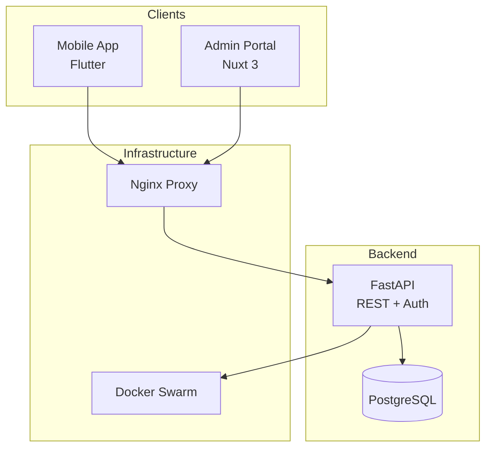

# IU Alumni Platform — Documentation

Welcome to the technical and project documentation for the **IU Alumni** platform.

## What's here

| Section | Description |
| ------- | ----------- |
| [Technical Documentation](technical/overview.md) | Architecture, stack decisions, and component design with Mermaid diagrams |
| [Requirements](requirements/functional.md) | Project goals overview, Functional requirements, quality attributes, and use-case specifications |
| [Metrics & Analytics](analytics/metrics.md) | KPIs, engagement metrics, and measurement methodology |
| [Sprints](sprints/sprint-1/team-meeting.md) | Meeting notes, retrospectives, and sprint records |

## Quick architecture overview

## Repository links

| Repo | Purpose |
| ---- | ------- |
| [iu-alumni-backend](https://github.com/iu-alumni/iu-alumni-backend) | FastAPI backend service |
| [iu-alumni-frontend](https://github.com/iu-alumni/iu-alumni-frontend) | Nuxt 3 admin portal |
| [iu-alumni-mobile](https://github.com/iu-alumni/iu-alumni-mobile) | Flutter mobile app |
| [iu-alumni-infra](https://github.com/iu-alumni/iu-alumni-infra) | Ansible + Terraform infrastructure |
