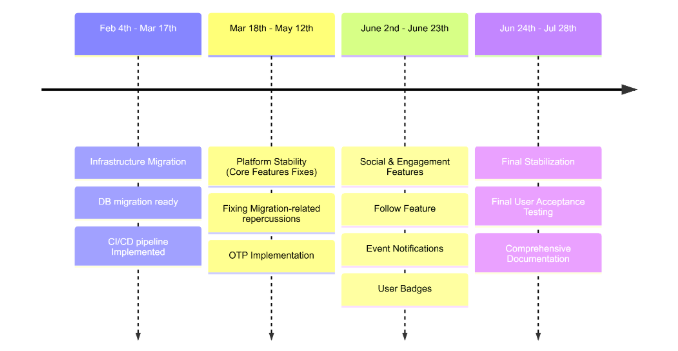

# Strategic & Tactical Plan — IU Alumni Platform (ALUMAP)

Period: Feb 4 – Jul 28 (≈ 24 weeks, 4 roadmap phases)

---

## Part 1 — Strategic Plan

### 1.1 Vision (where we want to be on July 28)

A self-hostable, university-operated alumni platform that can be handed over to a successor team and run for years with minimal intervention. By the end of July:

1. The platform runs on university infrastructure.
2. Every production change is gated by automated tests — not by exploratory testing.
3. The system is observable enough that an on-call engineer can answer "is something broken?" in under 60 seconds from a single dashboard.
4. The codebase is healthy enough that a new contributor can ship a feature in their first week without a senior pairing on every step.
5. Every quality claim in our documentation is backed by an evidence artifact that anyone can re-run.
6. New functionality (social and engagement features) is built on top of this foundation.

### 1.2 The strategic bet

ALUMAP is already in production. That changes the engineering problem. We are not building a system; we are *evolving a running one* through a server migration, feature phase, and 2 stabilization phases, without breaking the alumni already using it.

This forces three strategic choices:

1. Stability > velocity in the migration phase, velocity > polish in the feature phases, polish > everything in stabilization. The order matters; the ratio shifts at each phase boundary.
2. Quality investments are front-loaded. The test, security, and observability foundation built in phases 1–2 is what makes phases 3–4 fast. Feature work without that foundation looks fast for two sprints and then collapses.
3. The migration is the forcing function for everything we should already have done. If we cannot restore from backup, we cannot migrate. If we cannot run the test suite headlessly, we cannot validate the migration. If our dashboards do not tell us when the platform is broken, we will not know if the migration broke it. We use phase 1 to fix all three.

## 1.3 Strategic objectives & success criteria

Each strategic objective has a measurable end-state checked at the end of project.

| Objective | End-state criterion (Jul 25) | Measured by |
|---|---|---|
| O1. Operational independence | Platform runs on university infrastructure; complete handover runbook exists; quarterly restore drill executed | Runbooks committed in `iu-alumni-infra/docs/`; drill report dated within 90 days; deploy executed by a non-author |
| O2. Quality net | Backend coverage ≥ 80% on critical modules; mobile ≥ 60%; frontend ≥ 50%; full E2E regression suite of ≥ 25 scenarios green on every release | Coverage badges on every README; CI dashboards |
| O3. Security posture | Zero high-severity Bandit/Trivy/pip-audit findings; OWASP ZAP nightly green; quarterly threat-model review filed | CI artifacts + ADR record |
| O4. Performance under load | API p95 ≤ 500 ms at 500 concurrent users (k6 evidence); map renders 1,000 markers in ≤ 3 s on a mid-range Android | k6 reports + Flutter DevTools timeline |
| O5. Observability | RED metrics for every service, USE metrics for every resource, alert routing for every P0/P1 condition, error budget dashboard | Grafana dashboards as listed in QP §6 |
| O6. Documentation completeness | Every public API endpoint documented; requirements traceability matrix 100% mapped; onboarding guide enables a new contributor to ship in week 1 | docs CI green; matrix coverage report |
| O7. Process maturity | DORA: deployment frequency ≥ 1/day on `main`; lead time ≤ 24 h; change failure rate ≤ 15%; MTTR for P1 ≤ 1 h | DORA dashboard + incident log |
| O8. Accessibility & usability | SUS ≥ 75; WCAG 2.1 AA with 0 critical issues; ≥ 85% task completion in usability test | Usability report + axe-core artifact |

## 1.4 Strategic risks (top of mind, reviewed monthly)

| Risk | Why it threatens the vision | Strategic mitigation |
|---|---|---|
| Migration failure mid-window | Could destroy alumni trust and force a rollback to external server we no longer control | migration is done on several stages and we have a backup plan of last stable stage to roll back to in state of emergency |
| Single-person (DevOps) | One engineer holds the deploy, monitoring, and infra knowledge | documentation of everything is done to ease catch up later, and we have contact with that person |
| Notification spam in engagement features | Misconfigured notifications damage user trust faster than features build it | include rate limits, opt-out, and an observability panel for notifications-per-user-per-day before the feature ships |
| Documentation rot | Docs stop matching code, new contributors can't onboard, knowledge concentrates further | docs CI runs link/spell/lint and an OpenAPI-vs-doc diff on every PR; doc owner is named (Roukaya) |

---

## Part 2 — Tactical Plan (Phase-by-Phase)

Each phase has the same structure: theme → entry conditions → goals → workstreams → exit criteria → key risks → handoff to next phase. Exit criteria are the contract: a phase is not over when the calendar says so; it is over when the criteria are met. If it slips, it eats the next phase's buffer (deliberately reserved).

A standing rule applies in every phase: no production deploy goes out without all required CI checks green, and a rollback path documented. This is not repeated below; it is non-negotiable.

---

### Phase 1 + 2 — Infrastructure Migration & Stabilization

### Main objective

Move the platform from external hosting to university infrastructure. Lay down the foundation for easier future migrations if needed and environment for development.

### Why this phase comes first

Every later phase assumes we can deploy reliably, observe production, and recover from failure. Any feature work done before that foundation lands is built on sand.

### Entry conditions

- The previous team has handed over the codebase, documentation, and access to the current hosting environment.

### Goals

1. Migrate all production services (API, mobile web, admin portal, Telegram bot, Postgres, Nginx, Prometheus/Grafana) to university infrastructure with ≤ 1 h cumulative downtime and zero data loss.
2. Ratify the disaster-recovery procedure by performing one full restore drill from off-host backups before the migration date.
3. Stand up the foundational quality CI:
   - Container scanning (Trivy) on every image build
   - Secret scanning (gitleaks) on every PR
   - Branch protection on every repo (required reviews, CODEOWNERS, required status checks)
   - Dependabot/Renovate enabled across all repos (currently only `iu-alumni-infra`)
4. Rebuild Grafana dashboards around RED (per service) and USE (per resource) methods, retiring the cargo-culted PostgreSQL exporter panels.
5. Define and publish the SLOs that the rest of the year will be measured against (availability ≥ 99.5%, p95 ≤ 500 ms, error rate ≤ 0.5%).

### Workstreams

| Workstream | Owner | Deliverables |
|---|---|---|
| Migration execution | DevOps lead | Migration runbook (timed, scripted, dry-rehearsed twice); off-host backup verified; DNS cutover plan; rollback plan to old host valid for 14 days post-migration |
| CI hardening | DevOps lead | Trivy + gitleaks added to every repo's workflow; branch protection rules applied; Dependabot manifests for backend/mobile/frontend |
| Observability rebuild | DevOps lead | RED dashboards per service; USE dashboards per resource; alerts set |
| Backup & DR | DevOps lead | Off-host daily backup target configured; restore drill executed and report committed; cron exit code scraped by Prometheus; alert if last-success > 26 h |
| Documentation foundation | Documentation lead | Operational runbooks structure committed in `iu-alumni/docs/` |

### Tactical constraints

- No feature work merges to `main` during the migration window (24 h before through 24 h after the cutover). Feature branches stay open; PRs can be opened but not merged.
- The old host is not decommissioned for 14 days after migration; rollback path is held open for two weeks of soak time.
- Migration is executed during low-usage hours (validated against Prometheus traffic data from the previous month).

### Exit criteria

A phase-1 exit review checks each of the following. All must be green before phase 2 starts:

| # | Criterion | Evidence |
|---|---|---|
| 1 | Production runs on university infrastructure for ≥ 7 consecutive days with availability ≥ 99.5% | Grafana SLI panel screenshot + uptime log |
| 2 | Off-host daily backup is verified working and alerted on failure | Prometheus alert history; sample restore from off-host backup |
| 3 | RED + USE dashboards exist and replace the legacy PostgreSQL exporter view | Grafana dashboard JSON committed in repo |
| 4 | Trivy + gitleaks fail builds on high severity in all four code repos | CI run history showing intentional failure on a probe commit |
| 5 | Branch protection enforces required reviews + status checks on every repo | Repo settings screenshot |

---

## Phase 3 — Social & Engagement Features

### Main objective

Build the alumni social layer and long-term engagement systems together while shifting quality management from purely pre-release validation toward production observability, gradual rollouts, and operational resilience.

This combined phase introduces features that continuously operate between user actions — social graphs, notifications, scheduled jobs, recommendations, Telegram integrations, and engagement pipelines — while maintaining strong guarantees around privacy, authorization, usability, and runtime stability.

---

### Entry conditions

- Earlier Migration and platform stabilization phase is fully green.
- Social and engagement requirements are finalized and approved.

---

### Goals

1. Ship social and engagement features with privacy-by-design and operational observability built in from day one.
2. Extend authorization-matrix coverage for every new endpoint, role, relationship, and visibility rule.
3. Ensure every background job, cron task, webhook, and notification pipeline ships with:
   - metrics,
   - dashboards,
   - alerting,
   - documented SLOs,
   - and rollback procedures.
4. Maintain release velocity while protecting runtime reliability:
   - Deployment frequency ≥ 1 deploy/day
   - Change failure rate ≤ 15%
5. Conduct:
   - a usability study,
   - load testing,
   - and soak testing before full rollout.
6. The coverage ratchet:
   - Backend: ≥ 75% overall, ≥ 85% on critical modules
   - Mobile: ≥ 55% overall
   - Frontend: ≥ 50% overall
7. Push documentation maturity in parallel to avoid end-of-project compression.

---

### Exit criteria

| #  | Criterion                                                                   | Evidence                   |
| -- | --------------------------------------------------------------------------- | -------------------------- |
| 1  | All P0/P1 social and engagement flows have E2E coverage                     | Regression-suite reports   |
| 2  | Authorization matrix covers all endpoint × role × relationship combinations | Authorization test reports |
| 3  | Threat-model ADR completed with no unresolved P0/P1 mitigations             | ADR + ticket closure       |
| 4  | Every background job has metrics, dashboards, and alerts                    | Observability dashboards   |
| 5  | k6 load tests meet QAS201-QAS203 thresholds                                   | Performance report         |
| 6  | Soak tests complete without leaks or pool exhaustion                        | Soak-test report           |
| 7  | Notification rate limiting and opt-out behavior validated                   | Integration test outputs   |
| 8  | Telegram webhook validation and replay protection tested                    | Security test reports      |
| 9  | Coverage targets achieved                                                   | Coverage reports           |
| 10 | DORA metrics maintained (≥ 1 deploy/day, ≤ 15% CFR)                         | DORA dashboard             |
| 11 | OpenAPI vs documentation match ≥ 90%                                        | Docs CI report             |
| 12 | Usability study completed with SUS ≥ 70                                     | Usability report           |
| 13 | Zero open P0/P1 defects                                                     | Project board              |
| 14 | Stable feature flags removed or scheduled for removal                       | Feature-flag inventory     |

---

## Phase 4 — Final Stabilization

### Entry conditions

- Phase 3 exit criteria all green.
- All scheduled features are feature-complete (no new features merge in this phase except trivial fixes).
- Coverage and DORA metrics are at end-of-phase-3 levels.

### Goals

1. Hit final coverage targets:
   - Backend: ≥ 80% overall, ≥ 90% on auth, ≥ 85% on events/profile/admin
   - Mobile: ≥ 60% overall, ≥ 75% on `application/`
   - Frontend: ≥ 50% overall, ≥ 65% on stores
2. Run the full evidence-collection battery for every QAS in the Quality Plan:
   - Performance: k6 report at thresholds
   - Security: ZAP full scan + Bandit + Trivy + pip-audit reports clean
   - Accessibility: axe-core + Flutter scanner reports against WCAG 2.1 AA
   - Usability: SUS ≥ 75; task completion ≥ 85%
   - Reliability: 30-day uptime ≥ 99.5%; one quarterly restore drill
3. Complete the documentation set:
   - Contributor onboarding
   - Requirements traceability matrix (100% mapped)
   - Architecture Decision Records for every major choice
4. Validate handover by having a non-author execute a deploy from documentation alone.
5. Prepare the defense exhibit set mapped to the strategic objectives.

### Tactical constraints

- No new features merge in this phase. Bug fixes only. The cutoff is the phase-4 entry meeting.

### Exit criteria

| # | Criterion | Evidence |
|---|---|---|
| 1 | Final coverage targets hit | Coverage reports per repo |
| 2 | All QASs have a current, committed evidence artifact | Traceability matrix complete |
| 3 | Contributor onboarding doc complete | Doc files reviewed and merged |
| 4 | OWASP ZAP full scan clean of high-severity findings | Scan report |
| 5 | k6 load test green at QAS201 - QAS203 thresholds | k6 report |
| 6 | Accessibility: WCAG 2.1 AA, 0 critical issues | axe-core + Flutter scanner reports |
| 7 | Usability: SUS ≥ 75, task completion ≥ 85% | Study report |
| 8 | Architecture Decision Records committed for every major choice | ADR directory |
| 9 | All P0/P1/P2 bugs closed; P3+ documented in handover | Bug board |

### Key risks for this phase

- Polish work expands to fill the schedule. Mitigation: weekly reviews with explicit "stop" criteria for each part.
- Last-minute scope additions ("just one more feature"). Mitigation: scope freeze is calendared at phase entry; exceptions require PO approval and must trade against another item.

### Final handoff

A 60-minute handover review:

- Walk the strategic objectives; attach evidence to each.
- Identify any criterion not met and the impact.
- File the project closeout document; thank the team.
