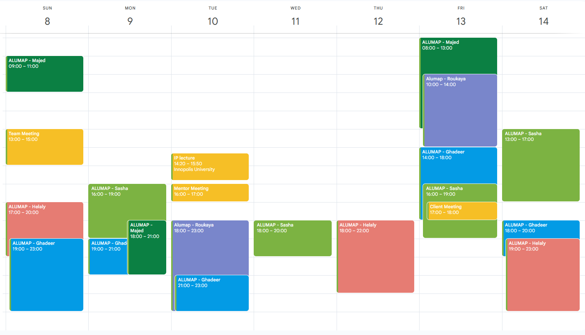

# Team Calendar

Our calendar tracks recurring meetings and members' week availability.

This helps us keep consistent communication between the team, mentor, and client.

## Recurring Meetings

| Weekly Meeting | Purpose |
| :----: | ---- |
| Client | Discuss requirements and progress |
| Mentor | Technical guidance and feedback   |
| Team | Sprint planning and coordination  |

## Calendar Overview

