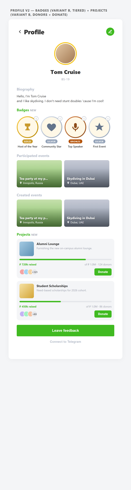
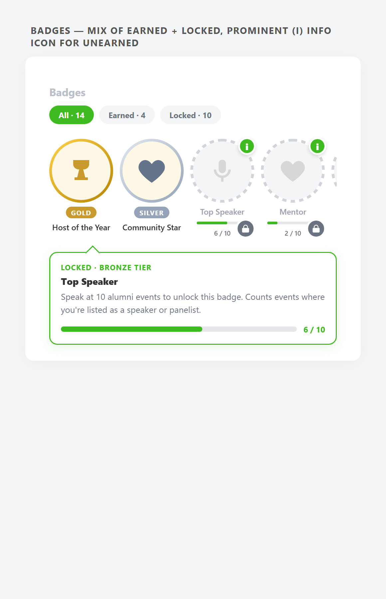
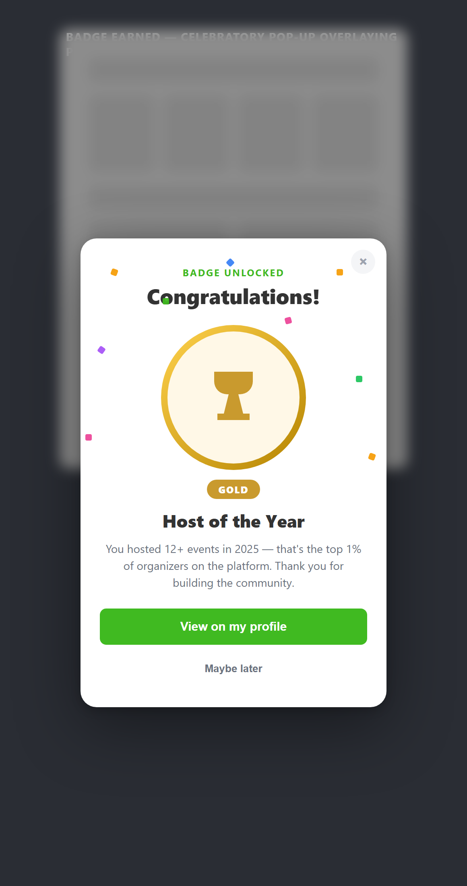
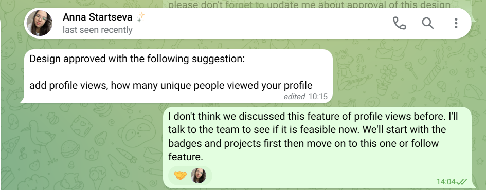
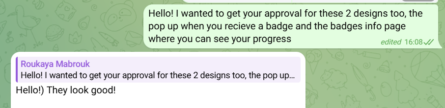

# Functional Requirements

## Authentication & User Management

- [ ] **FR3**: Implement secure password recovery functionality allowing users to reset forgotten passwords via email or telegram [issued](../sprints/sprint-1/client-meeting.md)
- [x] **FR4**: Fix email verification process to ensure reliable user email approval during registration [issued](../sprints/sprint-1/client-meeting.md)

## Event Management

- [x] **FR5**: Fix and optimize event creation workflow with proper validation and error handling [issued](../sprints/sprint-2/client-meeting.md)
- [ ] **FR6**: Send automatic notifications upon event creation to relevant users (e.g., followers, location-based notifications) [issued](../sprints/sprint-2/client-meeting.md), [reaffirmed](../sprints/sprint-13/client-meeting.md)

  **Definition of success**

  When a new event is approved and published, every alumnus matching at least one of the rules below receives exactly one notification.

  Who is notified
  - [ ] Alumni who **follow the event's location/city** (location-based notifications). Nearby cities may be grouped — e.g. Innopolis + Kazan share one bucket; Germany is its own.
  - [ ] Alumni who **follow the event's creator** (via FR8 mutual-follow).
  - [ ] Alumni who **declared the event's city as their live-in city** in their profile, even if they aren't actively following it.

  Delivery
  - [ ] In-app notification panel.
  - [ ] Telegram bot DM (only when the alumnus has connected Telegram).
  - [ ] No duplicates: an alumnus matching multiple rules still gets exactly one notification per event.

  Edge cases
  - [ ] The creator themselves is never notified about their own event.
  - [ ] Notifications fire only for events with `approved = true`. Drafts and pending-moderation events do not trigger anything.

## Maps & Location Services

- [ ] **FR7**: Implement automated map functionality with automatic location update every month with optional manual intervention [issued](../sprints/sprint-2/client-meeting.md)
<!-- - [ ] **FR10**: Enable accurate location pinning for events and venues with search and filter capabilities -->

## Social Features

- [ ] **FR8**: Add follow request feature enabling users to send, accept, and reject connection requests [issued](../sprints/sprint-2/client-meeting.md), [refined](../sprints/sprint-13/client-meeting.md)

  **Definition of success**

  - [ ] User can send a follow request to another alumnus; the request is **pending** until the recipient accepts or rejects.
  - [ ] Mutual visibility: once accepted, both users see each other's activity (created/joined events, profile updates).
  - [ ] Recipient sees pending requests in a dedicated list and can accept or reject each one.
  - [ ] User can **follow a city/location** directly (no confirmation needed — locations don't accept/reject).
  - [ ] User declares a **live-in city** in their profile; defaults the location-notifications bucket (FR6).
  - [ ] User can unfollow a person or a location at any time from their followers/following management screen.
  - [ ] Followers / Following counters appear on the profile (UI covered by [FR10](#user-profile)).

- [ ] **FR9**: Implement notification system for follow activities (requests, accepts, new followers) [issued](../sprints/sprint-2/client-meeting.md), [refined](../sprints/sprint-13/client-meeting.md)

  **Definition of success**

  An alumnus receives a notification when:
  - [ ] Someone sends them a follow request.
  - [ ] Their follow request is accepted.
  - [ ] A user they follow **creates a new event** (also covered by FR6 from the creator-follower path).
  - [ ] A user they follow **joins an event** (the canonical "stalker-friendly" social signal mentioned in the meeting).
  - [ ] A user they follow updates their profile significantly (new badge earned, new bio) — *optional, opt-out by default*.

  Delivery + control
  - [ ] In-app notification panel + Telegram bot DM.
  - [ ] Each category is independently mutable in user settings (e.g. opt out of "X joined an event" without losing request notifications).
<!-- - [ ] **FR10**: Provide privacy settings for follow preferences with followers/following management lists -->

## User Profile

- [ ] **FR10**: Provide a user profile screen that displays personal information, events created and participated, badges, and followers/following counts [issued](../sprints/sprint-3/client-meeting.md)
  - The look-and-feel and "intuitive layout" aspects are tracked as [QAS102 — Intuitive Profile Redesign](./quality-attributes.md#qas102) under Quality Requirements.

  **Approved designs**

  The following mockups were reviewed and approved by the client (see *Approval evidence* below).

  | Screen | Mockup |
  |---|---|
  | Profile with Badges + Projects | [`profile-v2-combined.png`](/approvals/profile-v2-combined.png) |
  | Badges section — earned + locked + tap-for-info | [`badges-locked.png`](/approvals/badges-locked.png) |
  | Badge-earned celebratory popup | [`badge-earned-popup.png`](/approvals/badge-earned-popup.png) |

  

  

  

  **Approval evidence**

  - **Anna Startseva** (Telegram, 10:15) — "Design approved with the following suggestion: add profile views, how many unique people viewed your profile." Approves the full profile redesign. Profile-views is captured as a future enhancement (deferred until after badges, projects, and follow ship); not part of FR10's definition of done.

    

  - **Roukaya Mabrouk** (Telegram, 16:08) — "Hello!) They look good!" Approves the celebratory popup and the badges info / progress page.

    

  **Definition of done**

  FR10 is considered done when every item below holds true on both the mobile app and the Telegram Mini App, against the agreed mockup (`mockups/06-profile-v2-combined.png` in `iu-alumni-frontend`).

  Layout & identity
  - [x] Top app bar shows back navigation, "Profile" title, and the contextual action (Edit on own profile, overflow menu on another user's profile).
  - [x] Avatar centered with the brand-yellow ring; falls back gracefully when no image is set.
  - [x] Display name and graduation group (e.g. "BS-19") render below the avatar.

  Content sections (in this order)
  - [x] Biography paragraph.
  - [x] **Badges** — horizontal scroll, earned tiles with tiered gold/silver/bronze rings, locked tiles with dashed gray ring, lock chip, mini progress bar, and tap-for-info icon. Full catalog, criteria, and per-badge implementation status live in [Badges Catalog & Status](./badges.md). *(Covered by [`backend#98`](https://github.com/iu-alumni/iu-alumni-backend/pull/98) and [`mobile#125`](https://github.com/iu-alumni/iu-alumni-mobile/pull/125).)*
  - [x] **Participated events** — horizontal scroll of event cards.
  - [x] **Created events** — same pattern, only shown on own profile.
  - [ ] **Projects** (donations / scholarships / lounge) — designed in mockups, not yet implemented.
  - [ ] **Followers / Following counters** — rendered under the identity row; gated on [FR8](#social-features).

  Interactions
  - [x] Tapping the edit button opens the edit-profile flow.
  - [x] Tapping a badge's `(i)` icon (hover on web, long-press on mobile) shows the badge description and earning criteria.
  - [x] Newly-earned badges trigger the celebratory popup the moment they unlock, from any tab.
  - [ ] Tapping a follower / following count opens the followers / following list screen; gated on FR8.
  - [ ] Empty-state copy provided for every content section (only Badges has it currently).

  Cross-cutting — verification before sign-off
  - [ ] Behaviour and visual language verified consistent across mobile and Telegram Mini App per [QAS601](./quality-attributes.md#qas601) (feature-parity checklist run, no gap > 5%).
  - [ ] Usability test for [QAS102](./quality-attributes.md#qas102) run with 20 users; ≥ 17 complete key profile tasks within 2 minutes unassisted.
  - [ ] PRs that touch the profile screen carry screenshots of the affected tabs in their description.

## Alumni Search & Filtering

- [ ] **FR16**: Provide search and filter functionality for admins to quickly locate specific alumni records by name, graduation year, and other relevant criteria

## Data Import/Export

- [x] **FR17**: Enable bulk importing of alumni data from CSV file format
- [x] **FR18**: Provide functionality to export alumni and event data for backup purposes or external analysis

## Event Listing & Browsing

- [x] **FR19**: Display a list of upcoming events to alumni users with sorting and filtering options by date, and location
- [x] **FR20**: Allow alumni to view detailed information of selected events including date, venue, donation, and description to facilitate participation decisions

## Notifications

- [x] **FR21**: Implement automated email notification system for key triggers including event registration confirmations, event reminders, and announcements

- [ ] **FR26**: Notify joined participants when an event they have joined changes [issued](../sprints/sprint-13/client-meeting.md)

  **Definition of success**

  Triggers — any of:
  - [ ] Event is **cancelled** (approved → cancelled, or hard-delete).
  - [ ] Event **time** changes (date or start time).
  - [ ] Event **location** changes (city, venue, or online/offline flag).
  - [ ] Event **description** or **cover image** changes substantially (substantive edit, not a typo fix — left to the editor's judgement / a "notify participants" checkbox).

  Recipients
  - [ ] Every alumnus listed in `events.participants_ids` at the time of the change.

  Delivery
  - [ ] In-app notification panel + Telegram bot DM.
  - [ ] Successive changes within ~5 min are bundled into a single message so a quick burst of edits doesn't spam attendees.
  - [ ] Cancellation is **always** delivered immediately, never batched.

- [ ] **FR27**: Notify event creators when their event's participation changes [issued](../sprints/sprint-13/client-meeting.md)

  **Definition of success**

  - [ ] Creator receives a notification when an alumnus **joins** their event.
  - [ ] Creator receives a notification when an alumnus **leaves** their event.
  - [ ] High-volume bursts are bundled (e.g. "5 new participants in the last hour") so popular events don't spam the creator.
  - [ ] Delivery: in-app notification panel + Telegram bot DM.
  - [ ] Creator can mute these per-event from the event detail screen.

## User Roles & Permissions

- [ ] **FR22**: Support distinct user roles with appropriate access levels including Admin users with full management capabilities for alumni data and events, and Alumni users with limited access focused on event registration only [issued](../sprints/sprint-1/client-meeting.md), [expanded](../sprints/sprint-13/client-meeting.md)

  **Definition of success**

  Roles supported
  - [x] **Admin** — full management of alumni records, events, badges, projects.
  - [x] **Alumni** — graduates. Required to provide a graduation year. Default role after manual approval.
  - [ ] **Alumni Friend** *(new — per [sprint-13 client meeting](../sprints/sprint-13/client-meeting.md))* — university staff, drop-outs who stayed in the community, and other non-graduate community members. Verified manually. **No graduation year**; their profile shows the "Alumni Friend" label instead, plus a free-text bio describing their relationship to the community.

  Distinctions in the UI
  - [ ] Alumni Friends are visibly distinct on profile cards and lists (label or chip in lieu of the graduation-year tag).
  - [ ] Admin panel exposes the Alumni Friend type for verification and editing.

## Reports Generation

- [ ] **FR23**: Enable administrators to generate comprehensive reports including event attendance tracking and alumni participation summaries [issued](../sprints/sprint-3/client-meeting.md)

## Payment & Donations

- [ ] **FR24**: Implement a field for donations or payment of event fees with link-based payment processing (e.g., Tinkoff) without requiring a legal entity for handling funds [issued](../sprints/sprint-6/client-meeting.md), [scoped](../sprints/sprint-13/client-meeting.md)

  **Definition of success**

  Per the sprint-13 client meeting, "Projects" are a **separate entity from events** — a cause alumni create that others contribute money to (examples: Alumni Lounge Zone, scholarships, planting trees).

  Project entity fields
  - [ ] Banner / cover image
  - [ ] Title
  - [ ] Free-text description ("what / why")
  - [ ] "Contribute" / "Donate" button → link-based payment (Tinkoff or equivalent)
  - [ ] Owner contact field so contributors can reach out with questions
  - [ ] *Anna to confirm the exact field list — placeholder above based on the meeting.*

  Lifecycle
  - [ ] Project owner can edit project details while the project is open.
  - [ ] Admin can close / archive a project.
  - [ ] Each contribution is logged against the project (handled by FR25).

- [ ] **FR25**: Allow admins to track donators and payments associated with events for reporting purposes (maybe with a form) [issued](../sprints/sprint-11/client-meeting.md), [scoped](../sprints/sprint-13/client-meeting.md)

  **Definition of success**

  - [ ] Each contribution is logged with: contributor user id, project id, amount (when available), and timestamp.
  - [ ] Admin can view the contributor list and totals per project.
  - [ ] Contributors can opt out of public listing for privacy.
  - [ ] A contributor optionally earns a **"Contributor"** badge (cross-reference to the [Badges Catalog](./badges.md)).
  - [ ] Reporting view exposes total raised, contributor count, and (optionally) top contributors.
