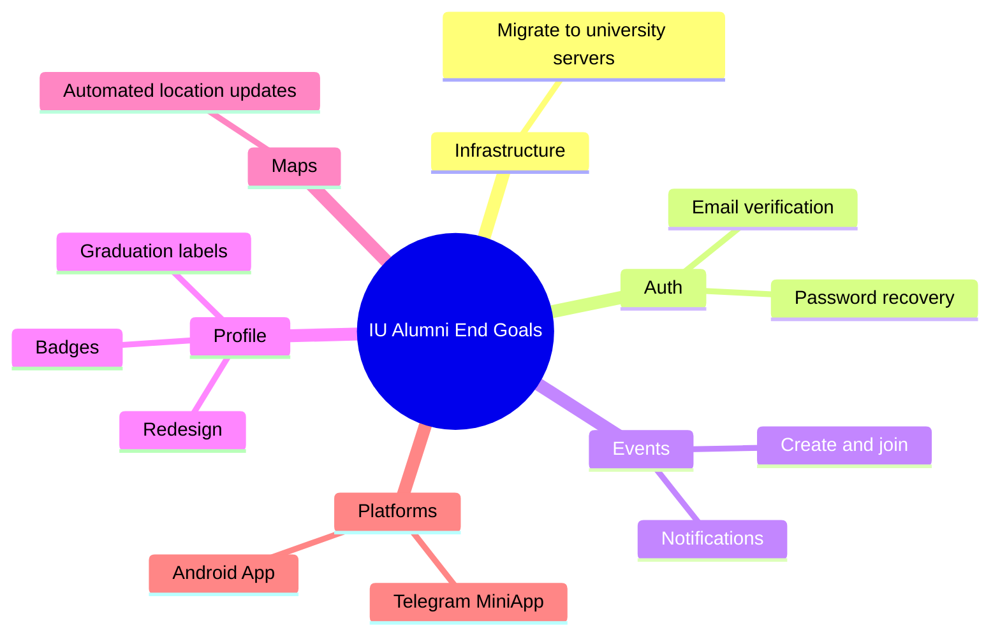

# Project End Goals

High-level goals for the IU Alumni platform handover. This document summarizes what the team will deliver by the end of the project based on [functional requirements](functional.md) and client meetings.

## Overview

## Main Components

| Area | End goal |
| --- | --- |
| **Infrastructure** | Migrate services to university servers; automated deployment with minimal downtime |
| **Authentication** | Password recovery, reliable email verification, account recovery |
| **Events** | Alumni create and join events independently; automatic notifications |
| **Profile** | Modern profile layout; graduation labels; achievement badges |
| **Maps** | Automated location updates (monthly); optional manual refresh |
| **Platforms** | Feature parity on Mobile app and Telegram Mini App |
