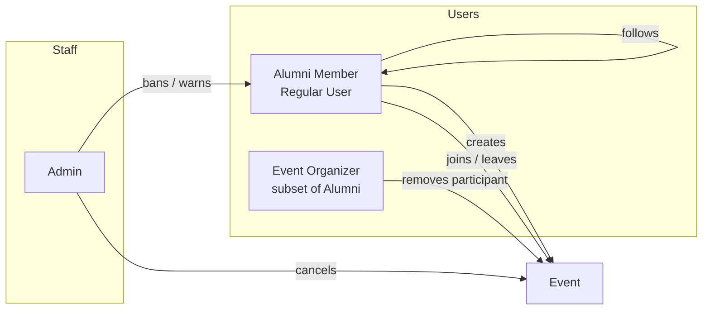
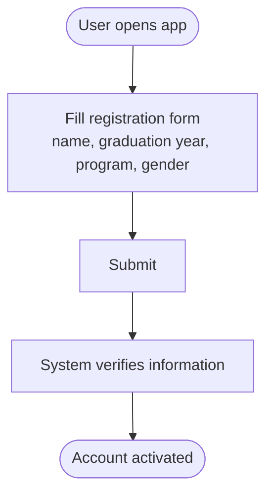
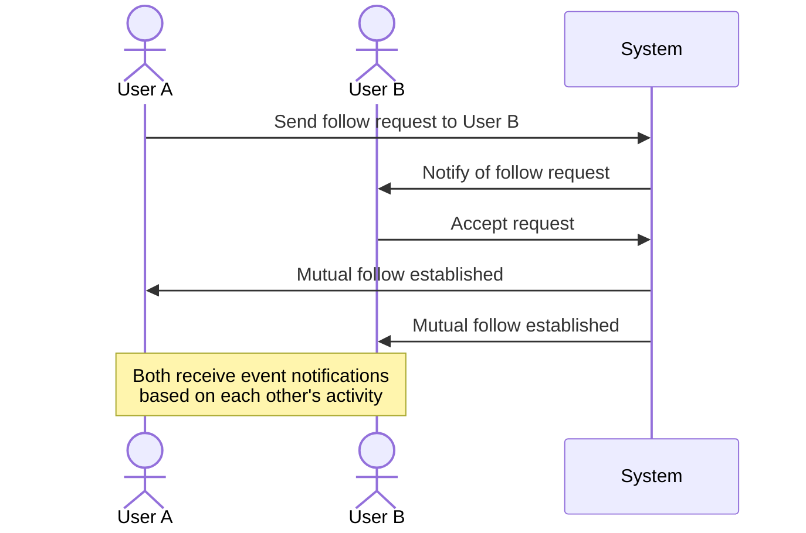
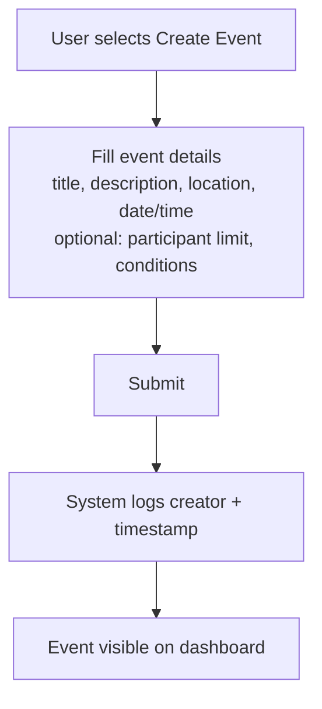
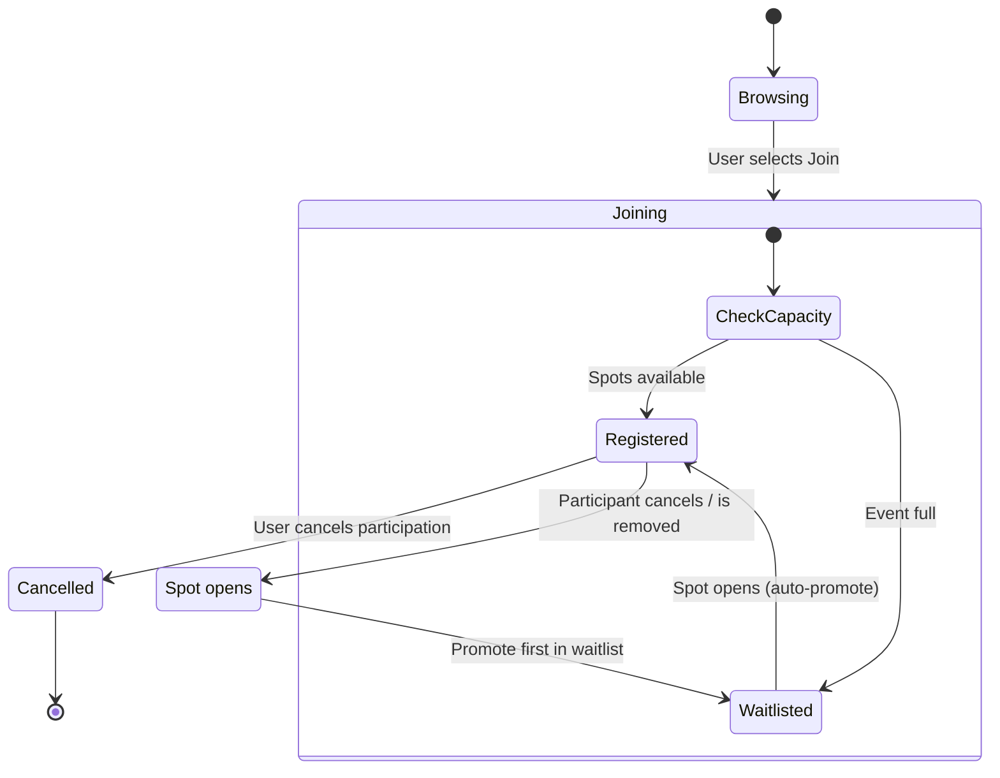
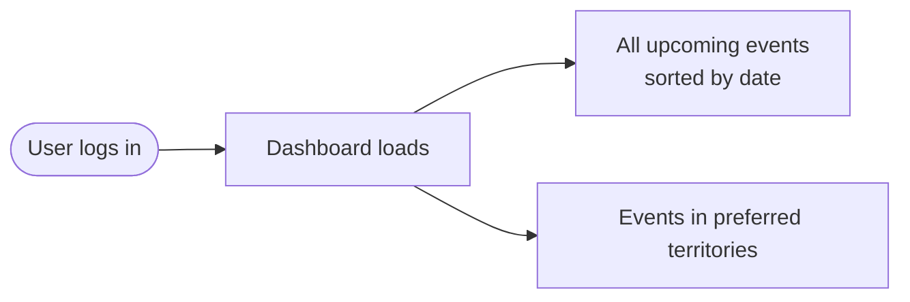
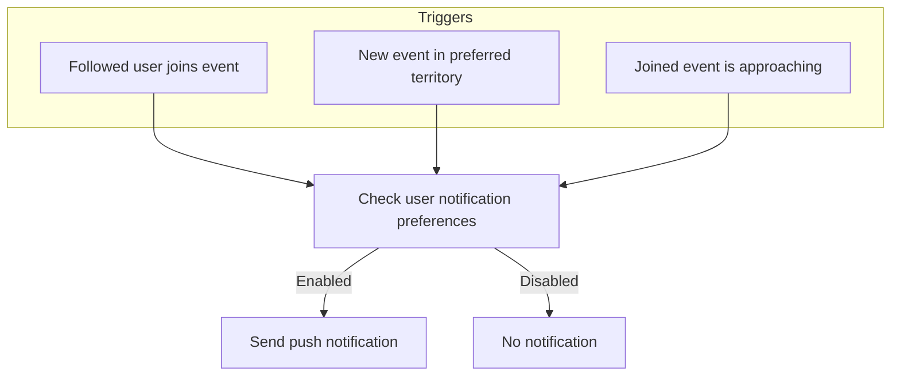
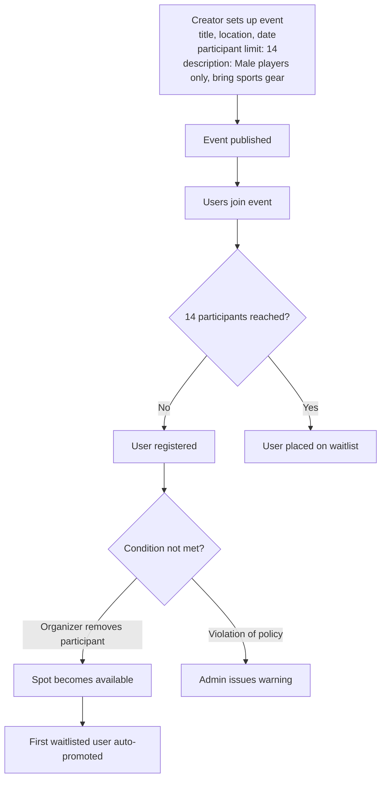

# Use Cases & User Stories

The Alumni Community Platform supports alumni in organizing and joining events worldwide, with admin oversight for community standards.

## Actors

### Actor Capabilities

| Capability | Alumni | Organizer | Admin |
|-----------|:------:|:---------:|:-----:|
| Register & manage profile | ✅ | ✅ | — |
| Create events | ✅ | ✅ | — |
| Join / leave events | ✅ | ✅ | — |
| Remove participants from own event | — | ✅ | — |
| Follow other users | ✅ | ✅ | — |
| Set notification preferences | ✅ | ✅ | — |
| Issue warnings | — | — | ✅ |
| Cancel events | — | — | ✅ |
| Ban / suspend accounts | — | — | ✅ |
| View event logs | — | — | ✅ |

---

## Functional Interfaces

1. **Personal Account & Profile** — registration, profile editing, achievement display, Telegram contact
2. **Event Creation & Scheduling** — title, description, location, date/time, capacity, conditions
3. **Dashboard** — global event feed sorted by date, territory filters
4. **Notification System** — push notifications for followed users, territory events, upcoming joined events
5. **Administration** — warnings, event cancellation, account suspension, audit logs

---

## Use Cases

### UC-01: User Registration

**Actor:** Alumni Member
**Precondition:** User does not have an account
**Postcondition:** Account created and activated

> **Note:** Gender is stored for optional event condition support; it does not automatically restrict participation.

---

### UC-02: View and Manage Personal Profile

**Actor:** Alumni Member
**Precondition:** User is logged in
**Postcondition:** Profile viewed or updated

**Viewable fields:** graduation year, program, achievements, Telegram contact (optional)

> **Business Rules:**
> - Users cannot directly message each other
> - Telegram contact sharing is optional

---

### UC-03: Mutual Follow Between Users

**Actor:** Alumni Member

---

### UC-04: Create Event

**Actor:** Alumni Member
**Precondition:** User is logged in
**Postcondition:** Event published and logged

> **Business Rules:**
> - No private events — all events are publicly visible
> - No event categories
> - Admins cannot edit events; only the creator can modify
> - Only admins can cancel events

---

### UC-05: Join Event

**Actor:** Alumni Member
**Precondition:** Event exists and user is logged in

> **Business Rules:**
> - No "Interested" status — users are either joined or on the waitlist
> - Organizers can remove participants manually
> - Waitlist auto-promotes when a spot opens

---

### UC-06: Dashboard — View Upcoming Events

**Actor:** Alumni Member

The dashboard displays all upcoming events globally, sorted by date. Users can filter by preferred territory.

---

### UC-07: Push Notification System

**Actor:** System (automated)

**User preferences:**
- Notify when a followed user joins an event
- Notify for events in selected territories
- Notify for upcoming events the user has joined

---

### UC-08: Admin Issues Warning

**Actor:** Admin

1. Admin reviews user behavior
2. Admin selects "Issue Warning"
3. System logs warning with actor + timestamp
4. User receives notification

**Postcondition:** Warning stored in user record

---

### UC-09: Admin Cancels Event

**Actor:** Admin

1. Admin selects event → "Cancel Event"
2. Event status updated to **Cancelled**
3. All participants receive push notification

---

### UC-10: Admin Cancels User Account

**Actor:** Admin

1. Admin reviews repeated violations
2. Admin suspends or permanently cancels account
3. User loses all platform access

---

### UC-11: Limited-Capacity Conditional Event (High Priority)

This use case reflects an explicit client requirement — the system **must** support capacity-limited, condition-based events.

**Example:** Alumni Football Match

**Actor:** Event Creator (Organizer)
**Supporting Actors:** Participants, Admin

**Special Rules:**
- Gender restriction is **description-based** — the system does NOT automatically block registration
- Organizer is responsible for manual enforcement
- Participation slots are strictly enforced by the system
- Waitlist auto-promotes when a spot opens

---

## User Stories

| ID | As a… | I want to… | So that… |
|----|-------|-----------|---------|
| US-01 | User | Create an event with a participant limit | I can organize structured activities |
| US-02 | User | Join an event directly | I can participate without approval delays |
| US-03 | User | Be placed on a waitlist when an event is full | I still have a chance to participate |
| US-04 | User | Receive notifications when someone I follow joins an event | I can join events my network is attending |
| US-05 | User | Receive notifications for events in selected locations | I stay informed about relevant events near me |
| US-06 | Admin | Issue warnings to rule-breaking users | Community standards are maintained |
| US-07 | Admin | Cancel inappropriate events | Platform integrity is preserved |
| US-08 | Event Organizer | Create a football event with limited players and optional gender condition | I can organize fair and structured sports activities |

---

## System Logging Requirements

The system must log every moderation and lifecycle action:

| Event | Logged Fields |
|-------|--------------|
| Event creation | creator, timestamp |
| Event cancellation | admin, timestamp, event ID |
| Warning issued | admin, target user, timestamp |
| Account suspension | admin, target user, timestamp |
| Participant removal | organizer, participant, event ID, timestamp |

---

## Key Constraints

| Constraint | Detail |
|-----------|--------|
| No private events | All events are globally visible |
| No event categories | Events are not classified |
| No direct messaging | Users communicate via optional Telegram sharing |
| Gender restriction | Optional, description-based only — not enforced by system |
| Event editing | Only the creator can edit; admins cannot |
| Event cancellation | Only admins can cancel events |
