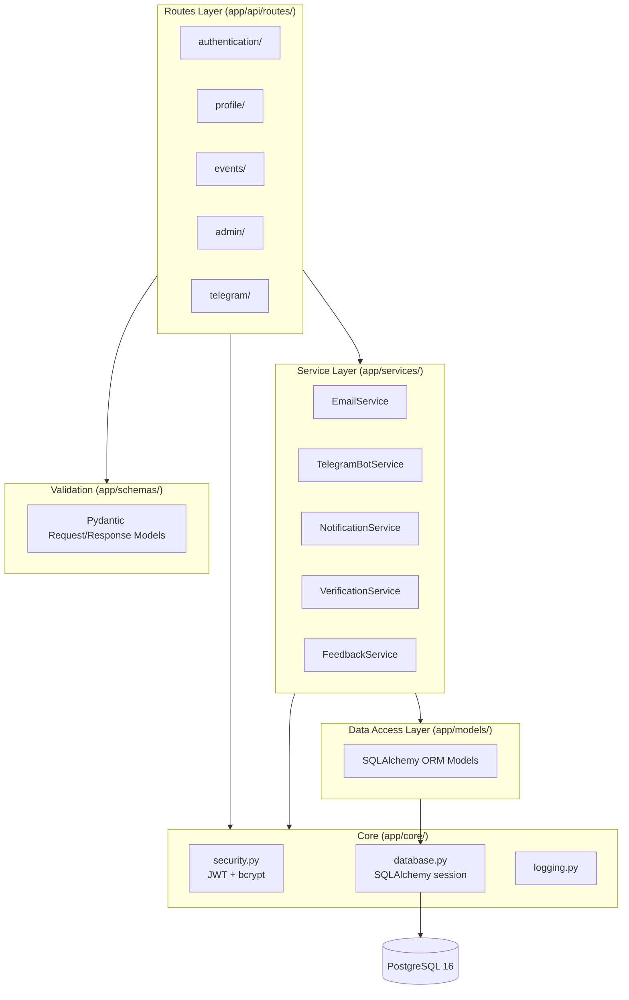
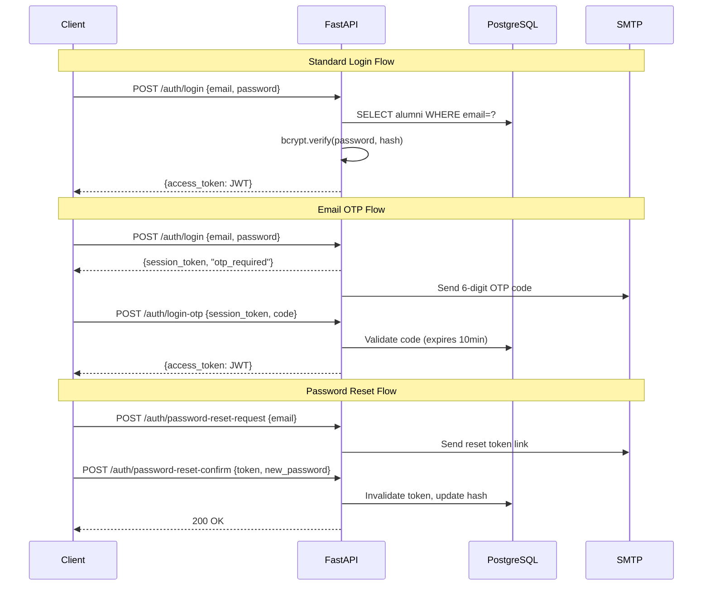

# Backend

The backend is a Python REST API built with **FastAPI**, following a layered architecture. It handles all business logic, database access, authentication, email notifications, and Telegram bot integration.

## Tech Stack

| Category | Technology | Version |
| -------- | ---------- | ------- |
| **Language** | Python | 3.11 |
| **Framework** | FastAPI | 0.110+ |
| **ASGI Server** | Uvicorn | 0.27+ |
| **ORM** | SQLAlchemy | 2.0+ |
| **Database** | PostgreSQL | 16 |
| **Migrations** | Alembic | 1.13+ |
| **Validation** | Pydantic | 2.0+ |
| **Password Hashing** | Passlib + bcrypt | bcrypt 4.0+ |
| **JWT** | python-jose | 3.3+ |
| **Email** | fastapi-mail | 1.5+ |
| **HTTP Client** | HTTPX | 0.24+ |
| **Metrics** | prometheus-fastapi-instrumentator | 6.1+ |
| **Linting** | Ruff | latest |
| **Testing** | Pytest | latest |

## Layered Architecture



## Project Structure

```text
iu-alumni-backend/
├── app/
│   ├── main.py                 # App init, router registration, lifespan
│   ├── api/routes/
│   │   ├── authentication/     # register, login, OTP, password reset
│   │   ├── profile/            # CRUD user profile
│   │   ├── events/             # event CRUD + participation
│   │   ├── admin/              # admin operations
│   │   ├── cities/             # city search
│   │   └── telegram/           # webhook handler
│   ├── core/
│   │   ├── database.py         # SQLAlchemy engine & session
│   │   ├── security.py         # JWT, password hashing, auth dependencies
│   │   └── logging.py          # structured logging
│   ├── models/                 # ORM models (10 tables)
│   ├── schemas/                # Pydantic request/response schemas
│   ├── services/               # business logic & external integrations
│   └── templates/
│       └── email/              # Jinja2 HTML email templates
├── alembic/                    # 15 migration versions
├── scripts/                    # send_event_reminders.py
├── cron/                       # crontab for background jobs
└── tests/
```

## API Endpoints

### Authentication (`/auth`)

| Method | Path | Description |
| ------ | ---- | ----------- |
| POST | `/register` | Register new alumni |
| POST | `/login` | Login with password → JWT |
| POST | `/login-otp` | Verify OTP → JWT |
| POST | `/verify` | Confirm email verification code |
| POST | `/password-reset-request` | Request password reset link |
| POST | `/password-reset-confirm` | Set new password via token |

### Profile (`/profile`)

| Method | Path | Description |
| ------ | ---- | ----------- |
| GET | `/` | Get own profile |
| PUT | `/` | Update own profile |
| GET | `/other/{id}` | Get another user's public profile |
| GET | `/other/{id}/avatar` | Fetch user avatar (base64, cached) |
| GET | `/map` | Alumni counts grouped by city/country for map pins |
| GET | `/users` | Paginated alumni list (cursor-based, server-filtered) |

### Events (`/events`)

| Method | Path | Description |
| ------ | ---- | ----------- |
| POST | `/` | Create event |
| GET | `/` | Paginated list of approved events (cursor-based, server-filtered) |
| GET | `/{id}/cover` | Fetch event cover image (base64, cached) |
| POST | `/{id}/participants` | Join event |

### Admin (`/admin`)

| Method | Path | Description |
| ------ | ---- | ----------- |
| POST | `/ban` | Ban a user |
| GET | `/events` | List all events (incl. unapproved) |
| POST | `/events/{id}/approve` | Approve an event |

### Other

| Prefix | Method | Path | Description |
| ------ | ------ | ---- | ----------- |
| `/cities` | GET | `/search` | Search cities by name |
| `/telegram` | POST | `/webhook` | Telegram bot webhook |

## Pagination

All list endpoints (`GET /profile/users`, `GET /events/`) use **cursor-based pagination** to provide stable, efficient paging over large datasets without the offset skew problem.

### Response shape

```json
{
  "items": [...],
  "next_cursor": "eyJpZCI6ICI0MiJ9",
  "has_more": true
}
```

### Query parameters

| Parameter | Type | Description |
| --------- | ---- | ----------- |
| `cursor` | `string \| null` | Opaque cursor from previous page's `next_cursor` |
| `limit` | `int` | Page size (default 20, max 100) |
| `search` | `string \| null` | Server-side text filter (name / title) |

### Cursor encoding

The cursor is a **base64-encoded JSON object** containing the sort key(s) of the last item seen.

```text
base64( JSON({ "id": "uuid" }) )               # ID-only cursor
base64( JSON({ "id": "uuid", "dt": "iso8601" }) )  # date+ID cursor (events)
```

The server decodes the cursor, applies a `WHERE (sort_key > cursor_value)` clause, and returns the next page. Clients treat the cursor as opaque — never construct or parse it.

### Slim response schemas

List endpoints return lightweight schemas to avoid sending large binary fields (avatars, covers) in bulk. Images are fetched separately on demand.

| Full schema | Slim list schema | Fields omitted |
| ----------- | ---------------- | -------------- |
| `AlumniProfile` | `AlumniListItem` | `avatar` (base64) |
| `Event` | `EventListItem` | `cover` (base64) |

## Map Endpoint

`GET /profile/map` returns alumni counts grouped by city for map-pin display. It is designed to be called once on map load and is read-only.

```json
{
  "locations": [
    { "country": "Russia", "city": "Innopolis", "lat": 55.75, "lng": 48.74, "count": 42 }
  ]
}
```

**How it works:**

1. Alumni store their location as a `"Country, City"` string.
2. PostgreSQL's `split_part()` function splits the string into `country` and `city` expressions.
3. These are JOINed against the `cities` table (indexed on `city` + `country`) to look up `lat`/`lng` coordinates.
4. Results are grouped and counted — the mobile client receives a single flat list of pins with no extra round-trips.

**Filters applied:**

- `show_location = true`
- `location IS NOT NULL` and matches `%, %` pattern
- `is_verified = true`
- `is_banned = false`

**Indexes used:**

| Index | Table | Purpose |
| ----- | ----- | ------- |
| `ix_alumni_show_location_location` | `alumni` | Leading filter on `show_location` + `location` |
| `idx_city_name` | `cities` | JOIN on city name |
| `idx_country` | `cities` | JOIN on country |

## Email Templates

All transactional emails are rendered from **Jinja2 HTML templates** located in `app/templates/email/`. The `fastapi-mail` `TEMPLATE_FOLDER` config points to this directory; each send function passes a `template_body` dict and specifies a `template_name`.

### Templates

| Template file | Triggered by | Key variables |
| ------------- | ------------ | ------------- |
| `_base.html` | (base layout, not sent directly) | `subject`, `content` block |
| `login_code.html` | 2FA login OTP | `first_name`, `code`, `expiry_minutes` |
| `password_reset.html` | Password reset request | `first_name`, `reset_link`, `expiry_minutes` |
| `verification.html` | Registration email verification | `first_name`, `verification_code` |
| `verification_success.html` | Account approved | `first_name` |
| `manual_verification.html` | Admin notification for manual review | `user_name`, `user_email` |

### Design

- **Table-based layout** — required for Outlook and older email clients (no `<div>` layout).
- **Fully inline CSS** — Gmail and many webmail clients strip `<style>` blocks; all styling is `style=""` attributes.
- **MSO conditional comments** — `<!--[if mso]>` blocks fix Outlook-specific rendering bugs (e.g. button width).
- **Responsive** — a single `@media (max-width: 620px)` block (the one case where `<style>` is safe) collapses padding and widths on mobile.
- **Brand colour** — IU Alumni green `#40BA21` used in the header bar and CTA buttons.

### SMTP configuration

| Environment variable | Default | Notes |
| -------------------- | ------- | ----- |
| `MAIL_SERVER` | `smtp.gmail.com` | SMTP host |
| `MAIL_PORT` | `587` | STARTTLS port |
| `MAIL_USERNAME` | — | Gmail address or Google Workspace user |
| `MAIL_PASSWORD` | — | **Must be a Google App Password** (16 chars). Regular account passwords are rejected by Google since Sep 2024. Generate at `myaccount.google.com → Security → App Passwords`. |
| `MAIL_FROM` | `noreply@innopolis.university` | Envelope From address |
| `MAIL_FROM_NAME` | `IU Alumni Platform` | Display name |

## Authentication Flow



## Database Schema (ERD)


## Design Patterns

| Pattern | Where Used |
| ------- | ---------- |
| **Dependency Injection** | `Depends(get_db)`, `Depends(get_current_user)` in every route |
| **Service Layer** | `EmailService`, `TelegramBotService`, `NotificationService` encapsulate external I/O |
| **Repository (via ORM)** | SQLAlchemy session used directly in services/routes for DB access |
| **Strategy** | Different auth flows (password, OTP, reset) behind same `/auth` prefix |
| **Factory** | `get_random_token()` for password reset & OTP code generation |
| **Middleware** | CORS, Prometheus instrumentation applied globally |
| **Lifespan** | FastAPI lifespan context for startup/shutdown hooks (Telegram polling) |

## Background Jobs

```mermaid
flowchart LR
    CRON[Cron (hourly)] --> SCRIPT[scripts/send_event_reminders.py]
    SCRIPT --> DB[(PostgreSQL<br/>query upcoming events)]
    SCRIPT --> TG[Telegram Bot API<br/>notify participants]
```

Events scheduled within ~12 hours are queried and notifications sent via Telegram. The cron job runs either as a Docker container (`docker-compose.cron.yml`) or a Kubernetes CronJob.

## Environment Variables

| Variable | Purpose |
| -------- | ------- |
| `SQLALCHEMY_DATABASE_URL` | PostgreSQL connection string |
| `SECRET_KEY` | JWT signing secret |
| `ENVIRONMENT` | `DEV` or `PROD` (controls docs visibility, log level) |
| `MAIL_SERVER` / `MAIL_USERNAME` / `MAIL_PASSWORD` | SMTP email credentials |
| `TELEGRAM_TOKEN` | Telegram Bot API token |
| `ADMIN_CHAT_ID` | Telegram chat ID for admin notifications |
| `CORS_ORIGINS` | Comma-separated allowed origins |
| `ADMIN_EMAIL` / `ADMIN_PASSWORD` | Default admin account seed |
