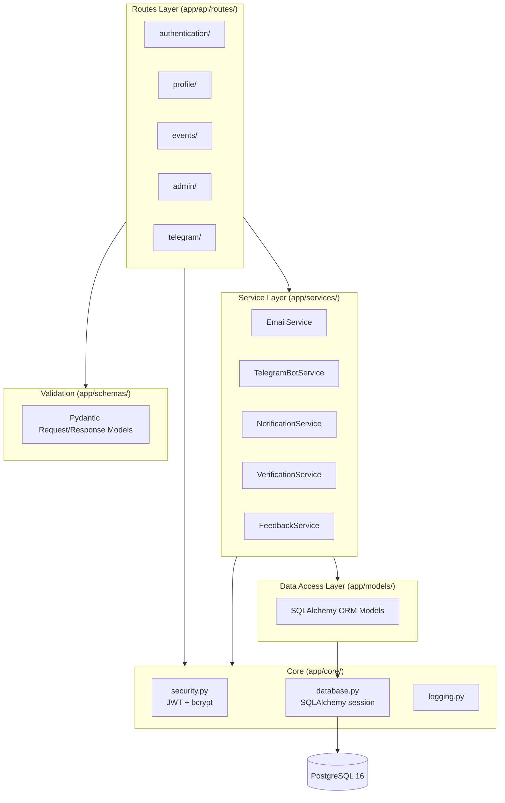
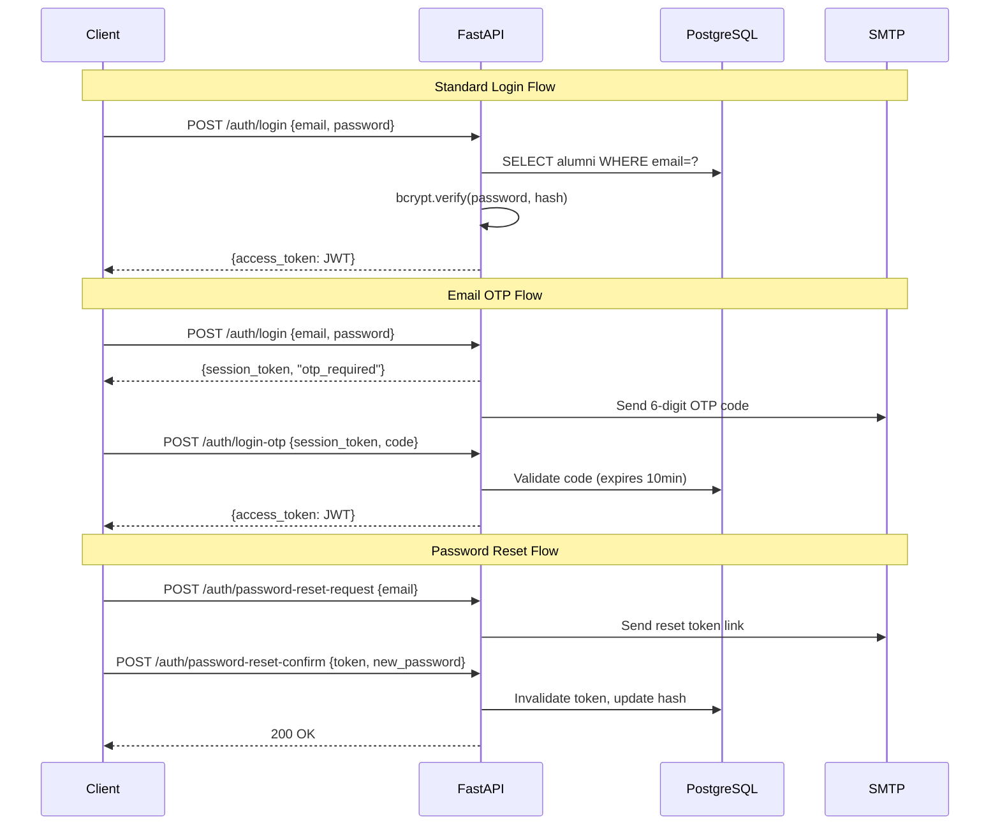
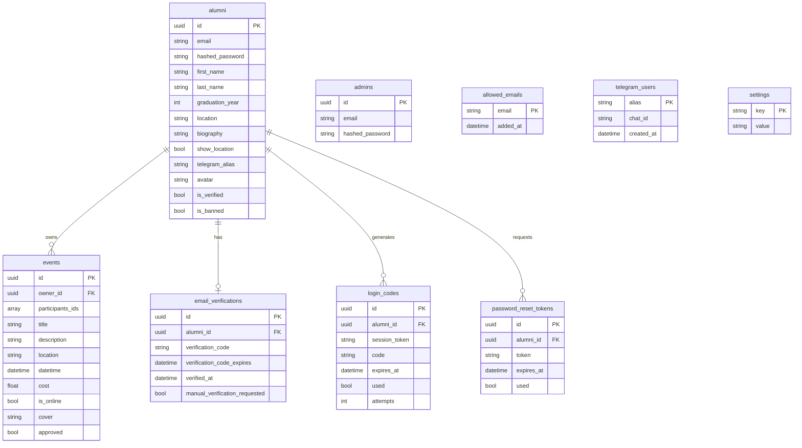

# Backend

The backend is a Python REST API built with **FastAPI**, following a layered architecture. It handles all business logic, database access, authentication, email notifications, and Telegram bot integration.

## Tech Stack

| Category | Technology | Version |
| -------- | ---------- | ------- |
| **Language** | Python | 3.11 |
| **Framework** | FastAPI | 0.110+ |
| **ASGI Server** | Uvicorn | 0.27+ |
| **ORM** | SQLAlchemy | 2.0+ |
| **Database** | PostgreSQL | 16 |
| **Migrations** | Alembic | 1.13+ |
| **Validation** | Pydantic | 2.0+ |
| **Password Hashing** | Passlib + bcrypt | bcrypt 4.0+ |
| **JWT** | python-jose | 3.3+ |
| **Email** | fastapi-mail | 1.5+ |
| **HTTP Client** | HTTPX | 0.24+ |
| **Metrics** | prometheus-fastapi-instrumentator | 6.1+ |
| **Linting** | Ruff | latest |
| **Testing** | Pytest | latest |

## Layered Architecture



## Project Structure

```text
iu-alumni-backend/
├── app/
│   ├── main.py                 # App init, router registration, lifespan
│   ├── api/routes/
│   │   ├── authentication/     # register, login, OTP, password reset
│   │   ├── profile/            # CRUD user profile
│   │   ├── events/             # event CRUD + participation
│   │   ├── admin/              # admin operations
│   │   ├── cities/             # city search
│   │   └── telegram/           # webhook handler
│   ├── core/
│   │   ├── database.py         # SQLAlchemy engine & session
│   │   ├── security.py         # JWT, password hashing, auth dependencies
│   │   └── logging.py          # structured logging
│   ├── models/                 # ORM models (10 tables)
│   ├── schemas/                # Pydantic request/response schemas
│   └── services/               # business logic & external integrations
├── alembic/                    # 15 migration versions
├── scripts/                    # send_event_reminders.py
├── cron/                       # crontab for background jobs
└── tests/
```

## API Endpoints

### Authentication

| Method | Path | Description |
| ------ | ---- | ----------- |
| POST | `/auth/register` | Register new alumni |
| POST | `/auth/login` | Login with password → JWT |
| POST | `/auth/login-otp` | Verify OTP → JWT |
| POST | `/auth/verify` | Confirm email verification code |
| POST | `/auth/password-reset-request` | Request password reset |
| POST | `/auth/password-reset-confirm` | Set new password |

### Profile

| Method | Path | Description |
| ------ | ---- | ----------- |
| GET | `/profile/me` | Get own profile (full, includes `avatar`) |
| PUT | `/profile/me` | Update own profile |
| GET | `/profile/{user_id}` | Get another user's full profile |
| GET | `/profile/{user_id}/avatar` | Get a user's avatar image only |
| GET | `/profile/all` | List all profiles — slim, cursor-paginated, searchable |

### Events

| Method | Path | Description |
| ------ | ---- | ----------- |
| POST | `/events/` | Create event |
| GET | `/events/` | List approved events — slim, cursor-paginated, searchable |
| GET | `/events/{id}` | Get full event detail (includes `cover`) |
| GET | `/events/{id}/cover` | Get an event's cover image only |
| POST | `/events/{id}/participants` | Join event |
| DELETE | `/events/{id}` | Delete event |
| PUT | `/events/{id}` | Update event |

### Admin

| Method | Path | Description |
| ------ | ---- | ----------- |
| GET | `/admin/users` | List all users — slim, cursor-paginated, searchable, filterable |
| POST | `/admin/ban/{id}` | Ban a user |
| POST | `/admin/unban/{id}` | Unban a user |
| POST | `/admin/verify` | Verify a user by email |
| GET | `/admin/events` | List all events (incl. unapproved) — slim, cursor-paginated, searchable |
| POST | `/admin/events/approve/{id}` | Approve an event |
| POST | `/admin/events/decline/{id}` | Decline an event |
| GET | `/admin/settings/events` | Get event auto-approval settings |
| POST | `/admin/settings/events/toggle-auto-approve` | Toggle auto-approve |

### Other

| Method | Path | Description |
| ------ | ---- | ----------- |
| GET | `/cities/search` | Search cities |
| POST | `/telegram/webhook` | Telegram bot webhook |

## Pagination

All list endpoints use **cursor-based (keyset) pagination** instead of offset pagination. This avoids the performance degradation that offset pagination suffers at high page numbers.

### Response shape

```json
{
  "items": [ ... ],
  "next_cursor": "eyJpZCI6IjEyMyIsImR0IjoiMjAyNi0wMy0wMVQxMjowMDowMCJ9"
}
```

`next_cursor` is `null` when there are no more pages.

### Query parameters

| Parameter | Type | Default | Description |
| --------- | ---- | ------- | ----------- |
| `cursor` | string | — | Opaque cursor from the previous response's `next_cursor` |
| `limit` | int | 50 | Page size (max 100) |
| `search` | string | — | Case-insensitive substring filter |
| `banned` | bool | — | (users only) filter by ban status |
| `verified` | bool | — | (users only) filter by verification status |

### Cursor encoding

The cursor is a base64-encoded JSON object. Clients should treat it as opaque.

- **Events** keyset: `(datetime DESC, id ASC)` → cursor encodes `{"id": "...", "dt": "ISO-8601"}`
- **Users / profiles** keyset: `(id ASC)` → cursor encodes `{"id": "..."}`

```python
# app/schemas/pagination.py
def encode_cursor(data: dict) -> str:
    return b64encode(dumps(data, default=str).encode()).decode()

def decode_cursor(cursor: str) -> dict:
    return loads(b64decode(cursor.encode()).decode())
```

### Slim list schemas

List endpoints return **slim schemas** that omit large base64 image fields. Detail endpoints still return the full object.

| Endpoint type | Schema | Omitted fields |
| ------------- | ------ | -------------- |
| `GET /events/` | `EventListItem` | `cover` |
| `GET /admin/events` | `EventListItem` | `cover` |
| `GET /admin/users` | `AlumniListItem` | `avatar`, `hashed_password` |
| `GET /profile/all` | `ProfileListItem` | `avatar` |
| `GET /events/{id}` | `Event` (full) | — |
| `GET /profile/{id}` | `ProfileResponse` (full) | — |

Images are fetched on demand via the dedicated `/avatar` and `/cover` endpoints (see below).

## Authentication Flow



## Database Schema (ERD)



## Image Endpoints

Because list responses omit `avatar` and `cover` to keep payloads small, two dedicated endpoints serve images on demand:

| Endpoint | Response | Cache-Control |
| -------- | -------- | ------------- |
| `GET /profile/{user_id}/avatar` | `{"avatar": "<base64> \| null"}` | `private, max-age=3600` |
| `GET /events/{event_id}/cover` | `{"cover": "<base64> \| null"}` | `private, max-age=3600` |

Both endpoints set `Cache-Control: private, max-age=3600` so the browser caches the response for one hour. The frontend also maintains an in-memory cache so navigating away and back does not re-fetch images already loaded in the same session.

## Performance Optimizations

### Database indexes

A migration adds indexes to the `events` table to speed up the most common query patterns:

| Index | Columns | Benefit |
| ----- | ------- | ------- |
| `ix_events_owner_id` | `owner_id` | Fast lookups by event owner |
| `ix_events_datetime` | `datetime` | Ordered list queries & keyset pagination |
| `ix_events_approved` | `approved` | Fast filtering of unapproved events |
| `ix_events_is_online` | `is_online` | Filter by online/in-person |
| `ix_events_cost` | `cost` | Filter/sort by cost |
| `ix_events_datetime_id` | `datetime DESC, id ASC` | Composite index for keyset cursor |

### Server-side search filtering

All list endpoints accept a `search` query parameter that applies `ILIKE '%term%'` filtering in the database. Previously, the frontend fetched all records and filtered them client-side in JavaScript.

### Stripped image payloads

`avatar` (base64 JPEG, up to ~100 KB per user) and `cover` (same) were previously included in every list response. Removing them from list schemas reduces payload size by an order of magnitude for pages with 50+ items.

### Response caching for images

The `/avatar` and `/cover` endpoints return `Cache-Control: private, max-age=3600`. This allows the browser to serve cached image data for subsequent requests within a one-hour window without hitting the server.

## Design Patterns

| Pattern | Where Used |
| ------- | ---------- |
| **Dependency Injection** | `Depends(get_db)`, `Depends(get_current_user)` in every route |
| **Service Layer** | `EmailService`, `TelegramBotService`, `NotificationService` encapsulate external I/O |
| **Repository (via ORM)** | SQLAlchemy session used directly in services/routes for DB access |
| **Strategy** | Different auth flows (password, OTP, reset) behind same `/auth` prefix |
| **Factory** | `get_random_token()` for password reset & OTP code generation |
| **Middleware** | CORS, Prometheus instrumentation applied globally |
| **Lifespan** | FastAPI lifespan context for startup/shutdown hooks (Telegram polling) |

## Background Jobs

```mermaid
flowchart LR
    CRON[Cron (hourly)] --> SCRIPT[scripts/send_event_reminders.py]
    SCRIPT --> DB[(PostgreSQL<br/>query upcoming events)]
    SCRIPT --> TG[Telegram Bot API<br/>notify participants]
```

Events scheduled within ~12 hours are queried and notifications sent via Telegram. The cron job runs either as a Docker container (`docker-compose.cron.yml`) or a Kubernetes CronJob.

## Environment Variables

| Variable | Purpose |
| -------- | ------- |
| `SQLALCHEMY_DATABASE_URL` | PostgreSQL connection string |
| `SECRET_KEY` | JWT signing secret |
| `ENVIRONMENT` | `DEV` or `PROD` (controls docs visibility, log level) |
| `MAIL_SERVER` / `MAIL_USERNAME` / `MAIL_PASSWORD` | SMTP email credentials |
| `TELEGRAM_TOKEN` | Telegram Bot API token |
| `ADMIN_CHAT_ID` | Telegram chat ID for admin notifications |
| `CORS_ORIGINS` | Comma-separated allowed origins |
| `ADMIN_EMAIL` / `ADMIN_PASSWORD` | Default admin account seed |
