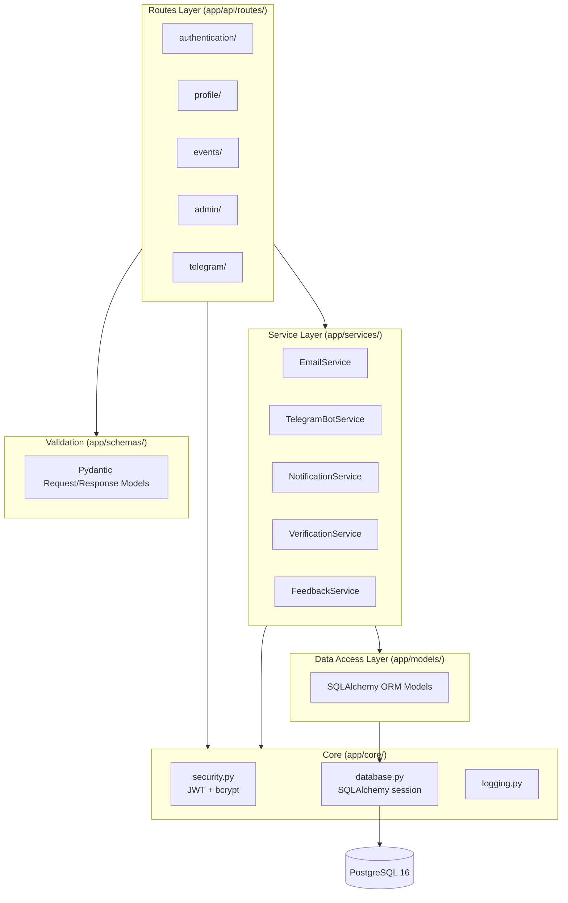
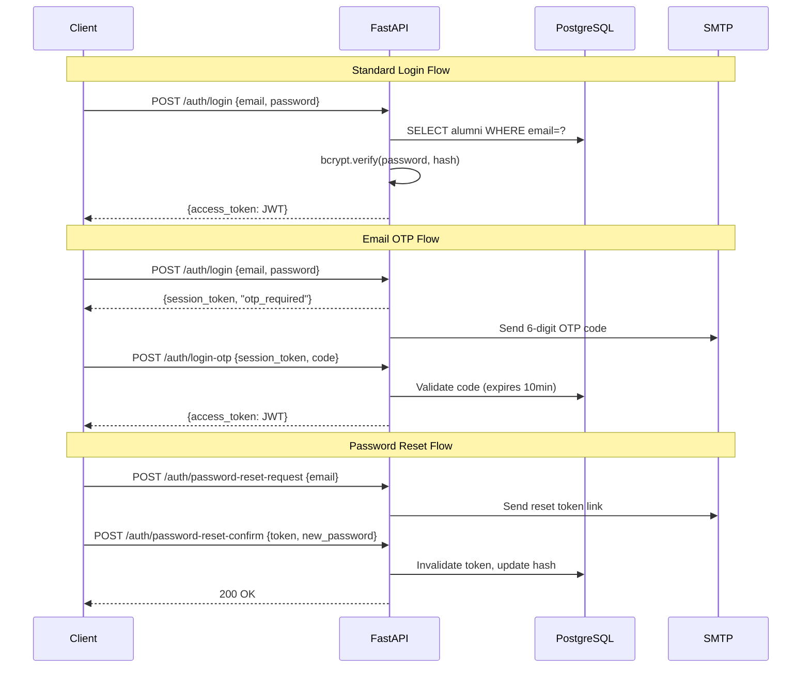

# Backend

The backend is a Python REST API built with **FastAPI**, following a layered architecture. It handles all business logic, database access, authentication, email notifications, and Telegram bot integration.

## Tech Stack

| Category | Technology | Version |
| ---------- | ----------- | --------- |
| **Language** | Python | 3.11 |
| **Framework** | FastAPI | 0.110+ |
| **ASGI Server** | Uvicorn | 0.27+ |
| **ORM** | SQLAlchemy | 2.0+ |
| **Database** | PostgreSQL | 16 |
| **Migrations** | Alembic | 1.13+ |
| **Validation** | Pydantic | 2.0+ |
| **Password Hashing** | Passlib + bcrypt | bcrypt 4.0+ |
| **JWT** | python-jose | 3.3+ |
| **Email** | fastapi-mail | 1.5+ |
| **HTTP Client** | HTTPX | 0.24+ |
| **Metrics** | prometheus-fastapi-instrumentator | 6.1+ |
| **Linting** | Ruff | latest |
| **Testing** | Pytest | latest |

## Layered Architecture



## Project Structure

```text
iu-alumni-backend/
├── app/
│   ├── main.py                 # App init, router registration, lifespan
│   ├── api/routes/
│   │   ├── authentication/     # register, login, OTP, password reset
│   │   ├── profile/            # CRUD user profile
│   │   ├── events/             # event CRUD + participation
│   │   ├── admin/              # admin operations
│   │   ├── cities/             # city search
│   │   └── telegram/           # webhook handler
│   ├── core/
│   │   ├── database.py         # SQLAlchemy engine & session
│   │   ├── security.py         # JWT, password hashing, auth dependencies
│   │   └── logging.py          # structured logging
│   ├── models/                 # ORM models (10 tables)
│   ├── schemas/                # Pydantic request/response schemas
│   └── services/               # business logic & external integrations
├── alembic/                    # 15 migration versions
├── scripts/                    # send_event_reminders.py
├── cron/                       # crontab for background jobs
└── tests/
```

## API Endpoints

| Prefix | Method | Path | Description |
| -------- | -------- | ------ | ------------- |
| `/auth` | POST | `/register` | Register new alumni |
| `/auth` | POST | `/login` | Login with password → JWT |
| `/auth` | POST | `/login-otp` | Verify OTP → JWT |
| `/auth` | POST | `/verify` | Confirm email verification code |
| `/auth` | POST | `/password-reset-request` | Request password reset |
| `/auth` | POST | `/password-reset-confirm` | Set new password |
| `/profile` | GET | `/` | Get own profile |
| `/profile` | PUT | `/` | Update own profile |
| `/profile` | GET | `/other/{id}` | Get another user's profile |
| `/events` | POST | `/` | Create event |
| `/events` | GET | `/` | List approved events |
| `/events` | POST | `/{id}/participants` | Join event |
| `/admin` | POST | `/ban` | Ban a user |
| `/admin` | GET | `/events` | List all events (incl. unapproved) |
| `/admin` | POST | `/events/{id}/approve` | Approve an event |
| `/cities` | GET | `/search` | Search cities |
| `/telegram` | POST | `/webhook` | Telegram bot webhook |

## Authentication Flow



## Database Schema (ERD)


## Design Patterns

| Pattern | Where Used |
| --------- | ----------- |
| **Dependency Injection** | `Depends(get_db)`, `Depends(get_current_user)` in every route |
| **Service Layer** | `EmailService`, `TelegramBotService`, `NotificationService` encapsulate external I/O |
| **Repository (via ORM)** | SQLAlchemy session used directly in services/routes for DB access |
| **Strategy** | Different auth flows (password, OTP, reset) behind same `/auth` prefix |
| **Factory** | `get_random_token()` for password reset & OTP code generation |
| **Middleware** | CORS, Prometheus instrumentation applied globally |
| **Lifespan** | FastAPI lifespan context for startup/shutdown hooks (Telegram polling) |

## Background Jobs

```mermaid
flowchart LR
    CRON[Cron (hourly)] --> SCRIPT[scripts/send_event_reminders.py]
    SCRIPT --> DB[(PostgreSQL<br/>query upcoming events)]
    SCRIPT --> TG[Telegram Bot API<br/>notify participants]
```

Events scheduled within ~12 hours are queried and notifications sent via Telegram. The cron job runs either as a Docker container (`docker-compose.cron.yml`) or a Kubernetes CronJob.

## Environment Variables

| Variable | Purpose |
| ---------- | --------- |
| `SQLALCHEMY_DATABASE_URL` | PostgreSQL connection string |
| `SECRET_KEY` | JWT signing secret |
| `ENVIRONMENT` | `DEV` or `PROD` (controls docs visibility, log level) |
| `MAIL_SERVER` / `MAIL_USERNAME` / `MAIL_PASSWORD` | SMTP email credentials |
| `TELEGRAM_TOKEN` | Telegram Bot API token |
| `ADMIN_CHAT_ID` | Telegram chat ID for admin notifications |
| `CORS_ORIGINS` | Comma-separated allowed origins |
| `ADMIN_EMAIL` / `ADMIN_PASSWORD` | Default admin account seed |
