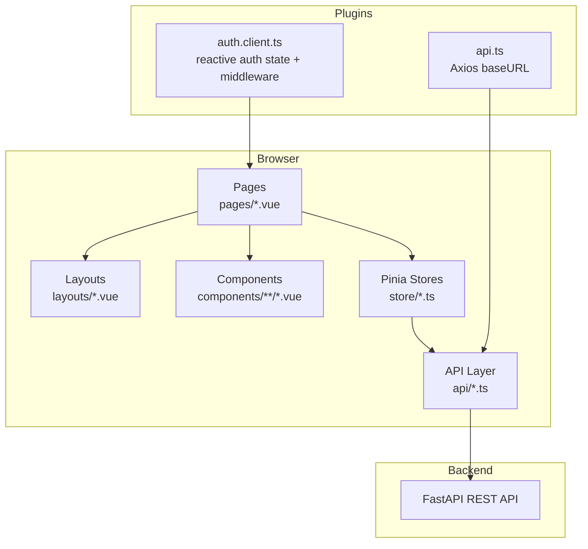
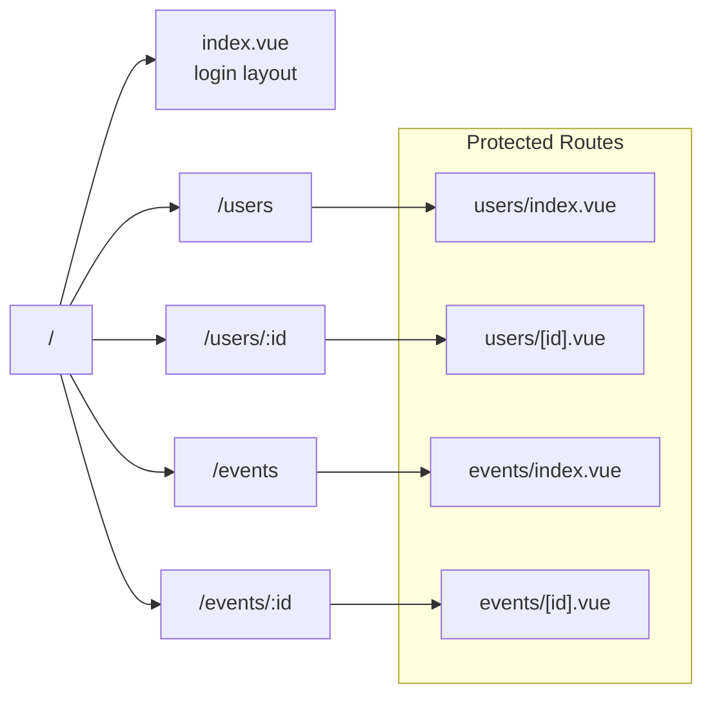
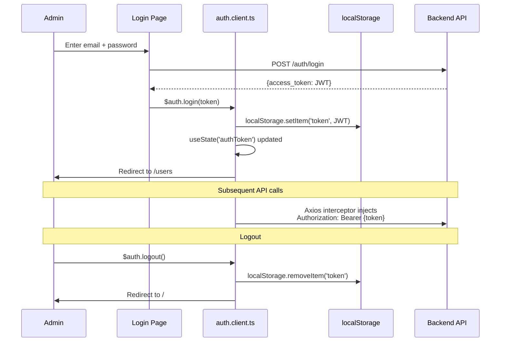
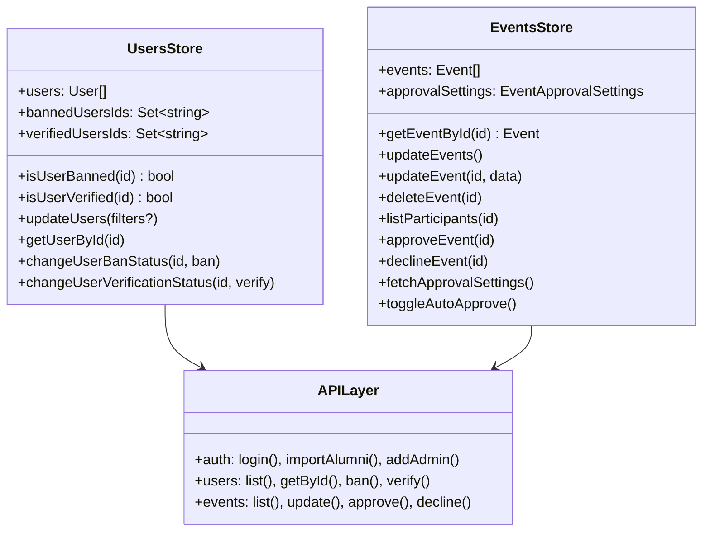
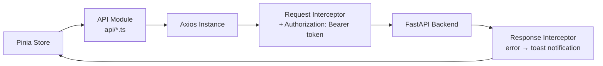

# Frontend (Admin Portal)

The frontend is a **Nuxt 3** server-side rendered admin portal. It is exclusively for administrators to manage alumni users, events, and platform settings. End-users (alumni) do not use this portal directly.

## Tech Stack

| Category | Technology | Version |
| -------- | ---------- | ------- |
| **Framework** | Nuxt 3 | latest |
| **UI Library** | Vue 3 | latest |
| **Language** | TypeScript | latest |
| **Package Manager** | pnpm | 10.4+ |
| **HTTP Client** | Axios | 1.8+ |
| **State Management** | Pinia | 3.0+ |
| **CSS Framework** | Tailwind CSS | latest |
| **Component Library** | shadcn-nuxt / Reka UI | 1.0+ / 2.0+ |
| **Icons** | Lucide Vue Next + Heroicons | latest |
| **Code Quality** | ESLint + Prettier + Husky | latest |
| **Bundler** | Vite (bundled with Nuxt 3) | — |

## Architecture Overview



## Project Structure

```text
iu-alumni-frontend/
├── pages/
│   ├── index.vue           # Login page (/)
│   ├── users/
│   │   ├── index.vue       # User management dashboard
│   │   └── [id].vue        # User detail / editor
│   └── events/
│       ├── index.vue       # Event management dashboard
│       └── [id].vue        # Event detail + participants
├── store/
│   ├── users.ts            # User list, ban/verify state
│   └── events.ts           # Event list, approval state
├── api/
│   ├── index.ts            # Axios instance (token interceptor)
│   ├── auth.ts             # Login, import alumni, add admin
│   ├── users.ts            # User CRUD, ban, verify
│   └── events.ts           # Event CRUD, approve, participants
├── components/
│   ├── common/             # 14 shared UI components
│   ├── user/               # User-specific components
│   ├── event/              # Event-specific components
│   └── ui/toast/           # shadcn Toast system
├── layouts/
│   ├── default.vue         # Main layout (with nav header)
│   └── login.vue           # Minimal layout for login page
├── plugins/
│   ├── auth.client.ts      # Auth state, middleware, redirects
│   └── api.ts              # Configure Axios base URL
├── types/
│   └── index.ts            # TypeScript types (User, Event, etc.)
└── nuxt.config.ts          # Nuxt configuration
```

## Routing

Nuxt 3's **file-based routing** automatically generates routes from the `pages/` directory:



## Authentication Flow



## State Management (Pinia)



## API Integration

The `api/index.ts` module creates a shared Axios instance with two interceptors:



## Design Patterns

| Pattern | Where Used |
| ------- | ---------- |
| **Module Store (Pinia)** | Separate stores per domain (`users.ts`, `events.ts`) |
| **Derived State (Set)** | `bannedUsersIds` / `verifiedUsersIds` as `Set<string>` for O(1) lookups |
| **API Abstraction Layer** | `api/*.ts` modules isolate HTTP calls from components |
| **Request Interceptor** | Centralized auth token injection via Axios interceptor |
| **Response Interceptor** | Global error handling with toast notifications |
| **Reactive Auth State** | `useState('authToken')` — Vue 3 composable for cross-component state |
| **Cross-tab Logout** | `storage` event listener in `auth.client.ts` |
| **Computed Filtering** | Client-side search and filter computation (ban status, verification) |

## UI Component System

The frontend uses **shadcn-nuxt** (port of shadcn/ui to Vue), providing headless components styled with Tailwind CSS.

Custom Tailwind color palette:

| Token | Hex | Usage |
| ----- | --- | ----- |
| `brandgreen` | `#40BA21` | Primary actions, highlights |
| `lightpink` | `#FF8591` | Danger/warning indicators |
| `darkpink` | `#BA2161` | Destructive actions |
| `darkgray` | — | Text |
| `lightgray` | — | Borders, backgrounds |

## Build & Tooling

| Script | Command | Purpose |
| ------ | ------- | ------- |
| `dev` | `nuxt dev` | Start dev server with HMR |
| `build` | `nuxt build` | Production SSR build |
| `generate` | `nuxt generate` | Static site generation |
| `lint` | `eslint --ext .ts,.vue --fix .` | Lint all TypeScript and Vue files |
| `format` | `prettier --write *.{vue,ts}` | Format code |
| `postinstall` | `nuxt prepare` | Generate `.nuxt/` typings |
