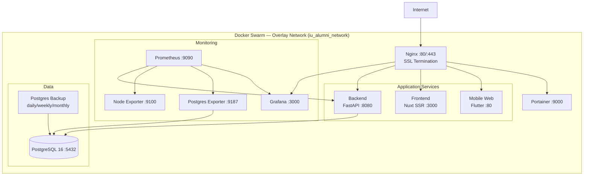
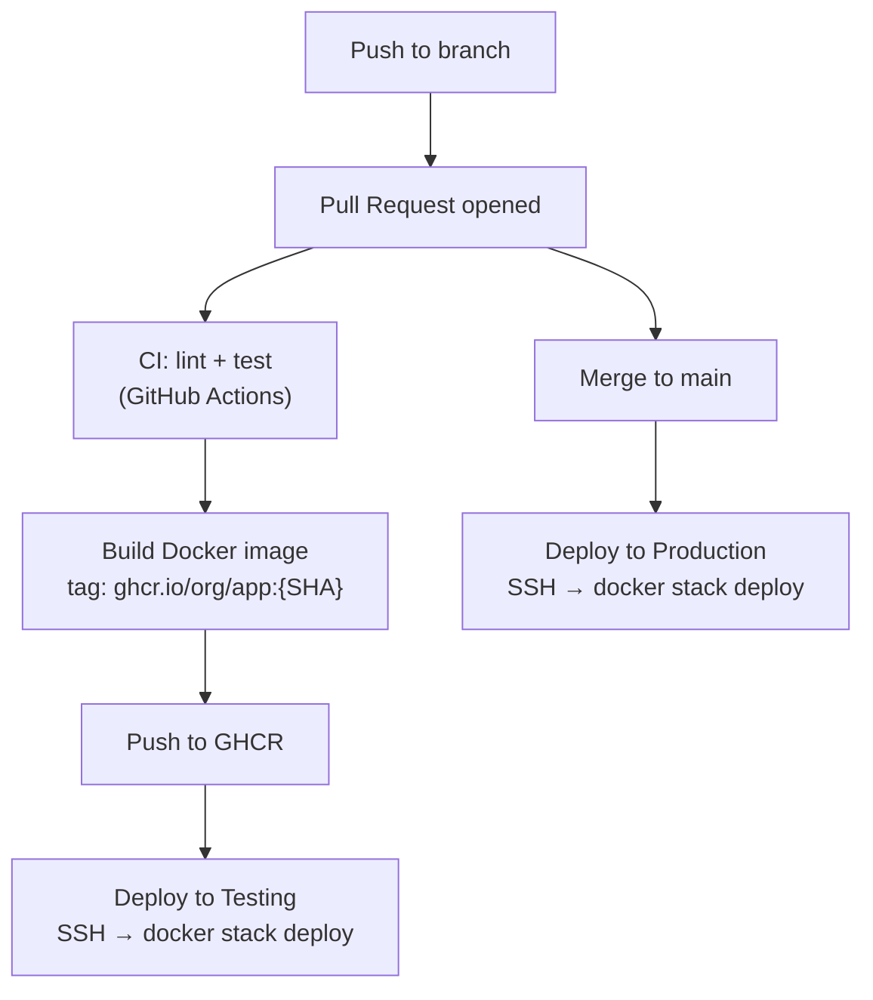
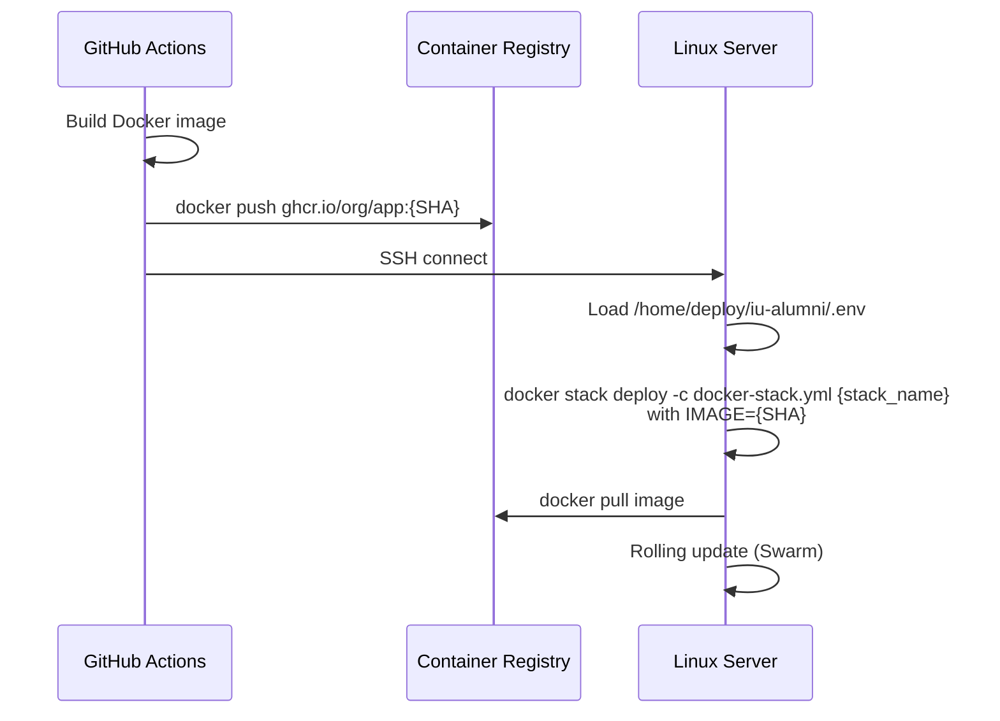
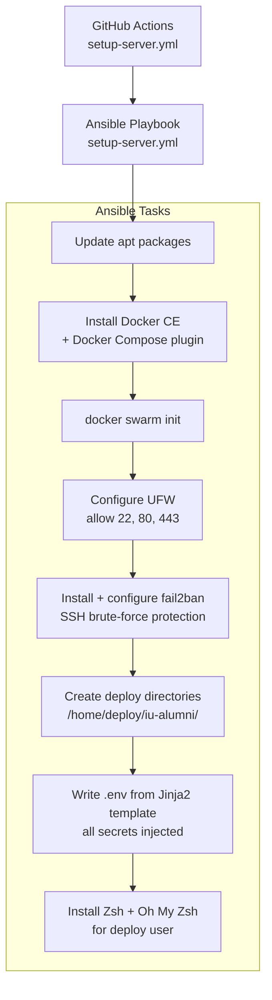
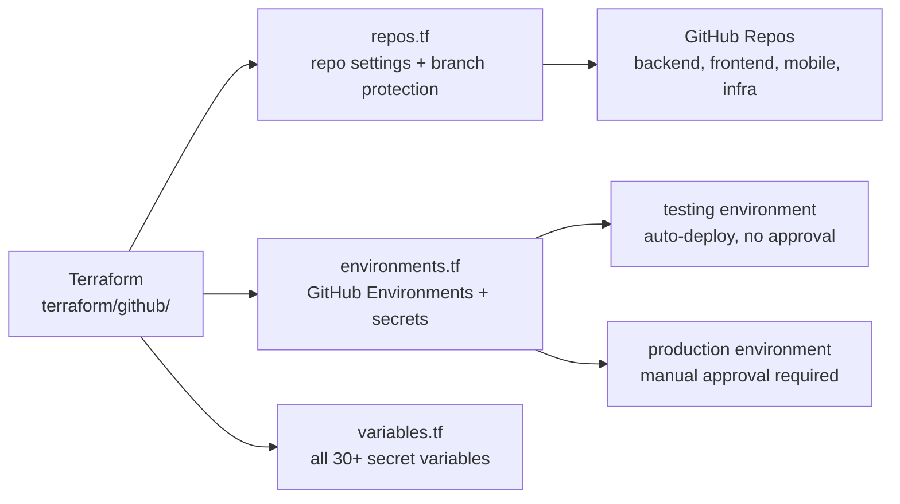
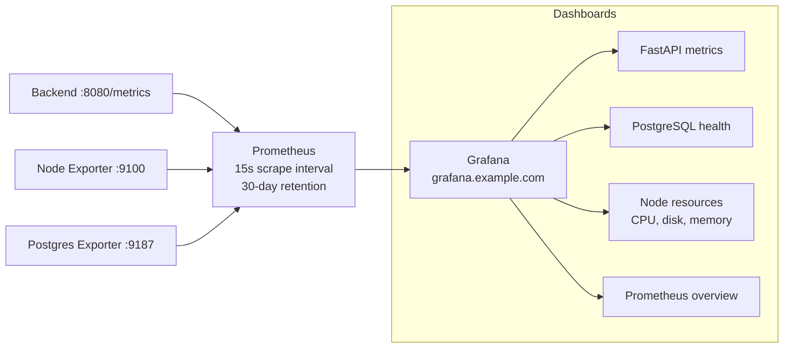

# Infrastructure

The infrastructure is a **single-server Docker Swarm** deployment managed through **Ansible** for server provisioning, **GitHub Actions** for CI/CD, and **Terraform** for GitHub repository and environment configuration.

## Tech Stack

| Category | Technology | Purpose |
|----------|-----------|---------|
| **Orchestration** | Docker Swarm | Container scheduling, networking, restarts |
| **Provisioning** | Ansible | Idempotent server setup (Docker, UFW, Fail2ban) |
| **IaC (GitHub)** | Terraform (GitHub provider) | Repo settings, branch protection, environments, secrets |
| **CI/CD** | GitHub Actions | Lint, build, deploy workflows |
| **Reverse Proxy** | Nginx | SSL termination, subdomain routing |
| **SSL** | Certbot / Let's Encrypt | Auto-renewed TLS certificates |
| **Metrics** | Prometheus + Grafana | Monitoring and dashboards |
| **Container Registry** | GitHub Container Registry (GHCR) | Docker image storage |

## Infrastructure Topology

## Domain Routing

| Subdomain | Service | Internal Target |
|-----------|---------|----------------|
| `alumni.example.com` | Frontend (Nuxt SSR) | `frontend:3000` |
| `api.alumni.example.com` | Backend (FastAPI) | `backend:8080` |
| `mobile.alumni.example.com` | Mobile Web (Flutter) | `mobile:80` |
| `grafana.alumni.example.com` | Grafana dashboards | `grafana:3000` |
| `portainer.alumni.example.com` | Docker Swarm UI | `portainer:9000` |

All HTTP traffic is redirected to HTTPS. TLS terminates at Nginx using Let's Encrypt certificates.

## Services Inventory

| Service | Image | Resources | Persistence |
|---------|-------|-----------|-------------|
| nginx | `nginx:alpine` | 0.5 CPU / 256 MB | nginx configs volume |
| certbot | `certbot/certbot` | — | `/data/certbot/` |
| postgres | `postgres:16` | pinned to manager | `/data/postgres/` |
| postgres-backup | `prodrigestivill/postgres-backup-local:16` | — | `/data/backups/` |
| portainer | `portainer/portainer-ce:latest` | — | portainer data volume |
| prometheus | `prom/prometheus:v2.52.0` | pinned to manager | `/data/prometheus/` (30-day retention) |
| grafana | `grafana/grafana:11.0.0` | — | grafana provisioning configs |
| node-exporter | `prom/node-exporter:v1.8.0` | global (all nodes) | — |
| postgres-exporter | `prometheuscommunity/postgres-exporter:v0.15.0` | — | — |

## CI/CD Pipeline

### Workflow Files

| Workflow | Trigger | Purpose |
|----------|---------|---------|
| `ci.yml` | PR / push to main | Lint YAML, Ansible, shell; validate Docker configs |
| `setup-server.yml` | Manual / Ansible file changes | Run Ansible playbook to provision server |
| `deploy.yml` | Push to main (infra files changed) | Redeploy infrastructure stack |
| `deploy-service.yml` | Reusable workflow | Deploy a specific app service (backend, frontend, mobile) |
| `update-env.yml` | Manual dispatch | Update server `.env` without full redeploy |
| `mobile.yml` | Manual / `repository_dispatch` | Build Flutter web + deploy |

### Deployment Detail (per service)

## Server Provisioning (Ansible)

The playbook is **idempotent** — safe to re-run at any time (e.g., after adding a new secret).

## Terraform: GitHub Repository Management

Terraform manages GitHub configuration as code:

**Repository enforcement:**
- Squash-merge only
- Auto-delete head branches on merge
- Required status checks before merging to `main`
- Branch deletion protection

## Monitoring Stack

## Environment Structure

| Property | Testing | Production |
|----------|---------|-----------|
| **Branch** | `develop` | `main` |
| **Deploy trigger** | Auto on push | Auto on merge to main |
| **Approval required** | No | Yes (manual) |
| **Domain** | configurable via secrets | configurable via secrets |
| **Secrets** | Separate set | Separate set |

## Security

| Layer | Mechanism |
|-------|-----------|
| **Firewall** | UFW — only ports 22, 80, 443 open |
| **Brute-force** | Fail2ban — 5 SSH failures → 3600s ban |
| **TLS** | Let's Encrypt (auto-renew every 12h via Certbot) |
| **Secrets** | GitHub Actions environment secrets → `.env` via Ansible |
| **Registry auth** | GHCR — GitHub token-based pull access |
| **Docker** | Overlay network (services not exposed to host by default) |

## Server Migration Pattern

The deployment is designed to be server-agnostic. To migrate to a new server:

1. Update `SERVER_HOST` GitHub secret to new server IP
2. Update DNS A-records to point to new IP
3. Trigger "Setup Server" GitHub Actions workflow
4. All services redeploy automatically — no code changes required
