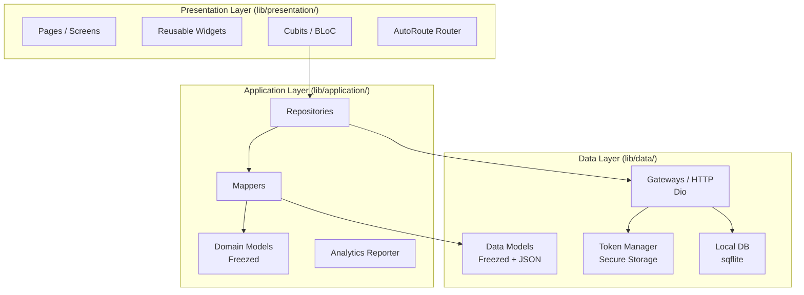
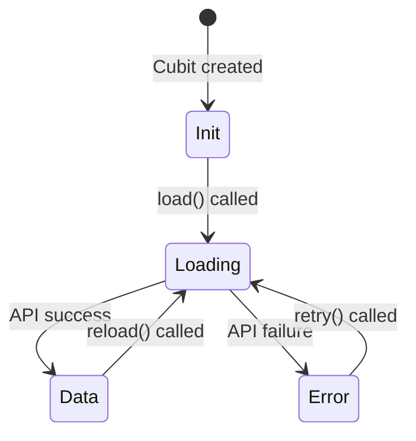
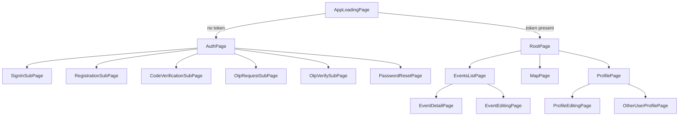
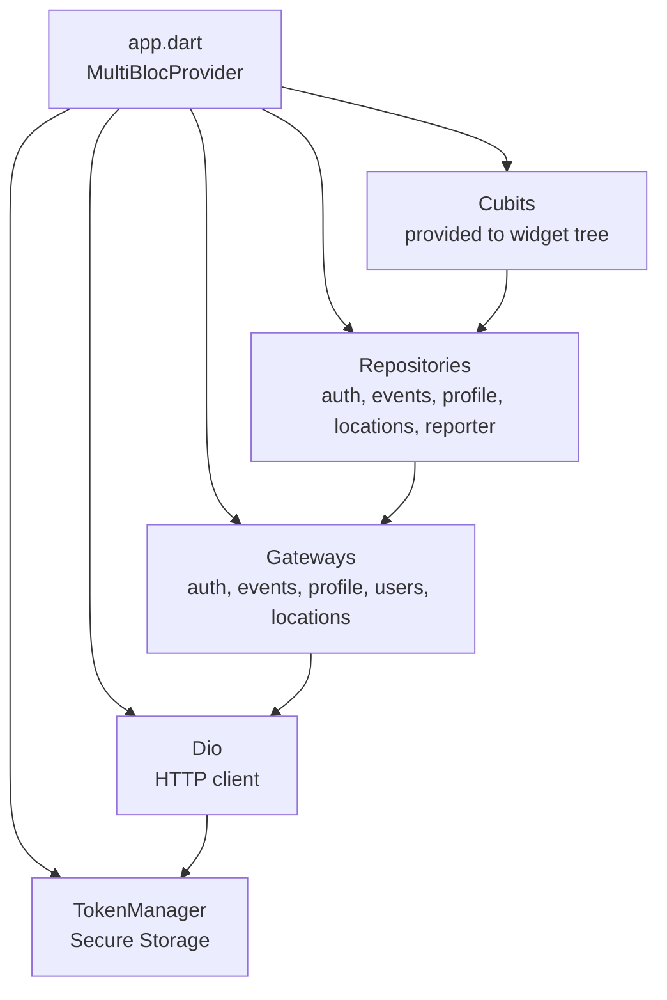
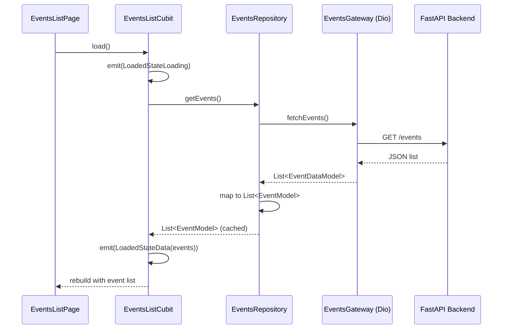

# Mobile App

The mobile application is built with **Flutter** and targets iOS, Android, and Web. It is the primary interface for alumni to browse events, manage their profiles, and interact with the platform.

## Tech Stack

| Category | Technology | Version |
| -------- | ---------- | ------- |
| **Language** | Dart | ^3.8+ |
| **Framework** | Flutter | ^3.32+ |
| **State Management** | flutter_bloc (Cubit) | ^9.0+ |
| **Navigation** | AutoRoute | ^9.3+ |
| **HTTP Client** | Dio | ^5.8+ |
| **Serialization** | Freezed + json_serializable | ^2.5, ^6.9 |
| **Error Handling** | fpdart (functional) | ^1.1+ |
| **Secure Storage** | flutter_secure_storage | ^9.2+ |
| **Local Database** | sqflite (mobile) | ^2.4+ |
| **Maps** | flutter_map | latest |
| **SVG Support** | flutter_svg | latest |
| **Analytics** | AppMetrica | native |
| **Code Generation** | build_runner + freezed_runner | latest |
| **Logging** | logger | ^2.5+ |

## 3-Layer Architecture



## Project Structure

```text
lib/
├── main.dart                     # Entry point, system UI config
├── app.dart                      # MultiBlocProvider DI, MaterialApp, AutoRoute
├── data/
│   ├── gateways/                 # HTTP interfaces + Dio implementations
│   │   ├── auth_gateway.dart / _impl.dart
│   │   ├── events_gateway.dart / _impl.dart
│   │   ├── profile_gateway.dart / _impl.dart
│   │   ├── users_gateway.dart / _impl.dart
│   │   └── locations_gateway.dart / _impl.dart
│   ├── models/                   # JSON-mapped Freezed data models
│   ├── token/                    # TokenManager + secure storage persistence
│   ├── config/                   # API base URL config (web vs mobile)
│   ├── paths.dart                # API endpoint string constants
│   ├── secrets/                  # AppMetrica key loader
│   └── db/                      # sqflite DB manager
├── application/
│   ├── repositories/             # Business logic interfaces + implementations
│   │   ├── auth/
│   │   ├── events/               # With in-memory caching
│   │   ├── users/
│   │   ├── locations/
│   │   └── reporter/             # AppMetrica / Mock analytics
│   ├── models/                   # Domain models (Freezed)
│   │   ├── profile.dart
│   │   ├── event.dart
│   │   ├── cost.dart
│   │   └── ...
│   └── mappers/                  # DataModel → DomainModel converters
├── presentation/
│   ├── router/                   # AutoRoute config + generated routes
│   ├── blocs/                    # Cubits (one per feature)
│   ├── pages/                    # Screen widgets
│   ├── managers/                 # app_loading_manager.dart (startup orchestration)
│   └── common/
│       ├── constants/            # AppColors, AppTextStyles
│       └── widgets/              # Shared reusable widgets
└── util/
    └── logger.dart
```

## State Management: Cubit Pattern

Cubits are the lighter variant of BLoC — they emit states directly via functions instead of processing events.

### Generic LoadedState



All Cubits use a sealed `LoadedState<T>` class:

```text
LoadedState<T>
├── LoadedStateInit()        — initial/idle
├── LoadedStateLoading()     — async operation in progress
├── LoadedStateData(T data)  — success with typed payload
└── LoadedStateError(String) — failure with message
```

### Cubit Inventory

| Cubit | Scope | Responsibility |
| ----- | ----- | -------------- |
| `AuthCubit` | Auth pages | Email/password login, validation |
| `RegistrationCubit` | Registration page | Registration form + API call |
| `EventsListCubit` | Global (root) | Load + cache event list |
| `ProfileCubit` | Global (root) | Load current user profile + participation |
| `ProfileEditingCubit` | Edit profile page | Update bio, photo, social links |
| `OneEventCubit` | Event detail page | Fetch event, join/leave |
| `RootPageCubit` | Root page | Bottom navigation tab index |
| `PinLocationsCubit` | Map page | Load event pins for map |
| `PasswordReset*Cubits` | Password reset pages | Request + confirm reset flow |

## Navigation (AutoRoute)



## Dependency Injection

Dependencies are wired at app startup in `app.dart` using Flutter's `MultiBlocProvider`:



Services are accessed via `context.read<T>()` throughout the widget tree.

## Data Flow: Load Events



## Error Handling Strategy

The app uses **fpdart** `Either<L, R>` types in the repository layer:

- `Right<EventModel>` — success path
- `Left<AppError>` — typed error (network failure, auth error, not found, etc.)

Cubits pattern-match on `Either` to emit `LoadedStateData` or `LoadedStateError`.

## Analytics

The analytics reporter is abstracted behind an interface:

| Implementation | When Used |
| -------------- | --------- |
| `ReporterAppMetrica` | Production builds (uses AppMetrica SDK) |
| `ReporterMock` | Testing / development (no-op) |

## Platform Notes

| Platform | Config Source | Token Storage |
| -------- | ------------- | ------------- |
| **Android / iOS** | App environment | `flutter_secure_storage` (Keychain/Keystore) |
| **Web** | `window.apiBaseUrl` injected at build time | Browser secure storage |
