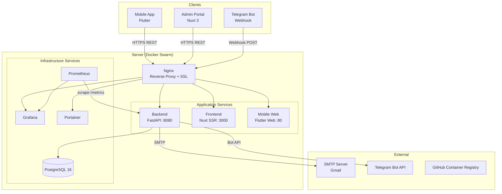
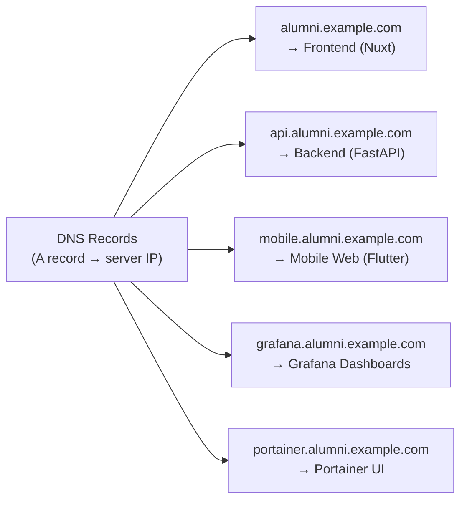
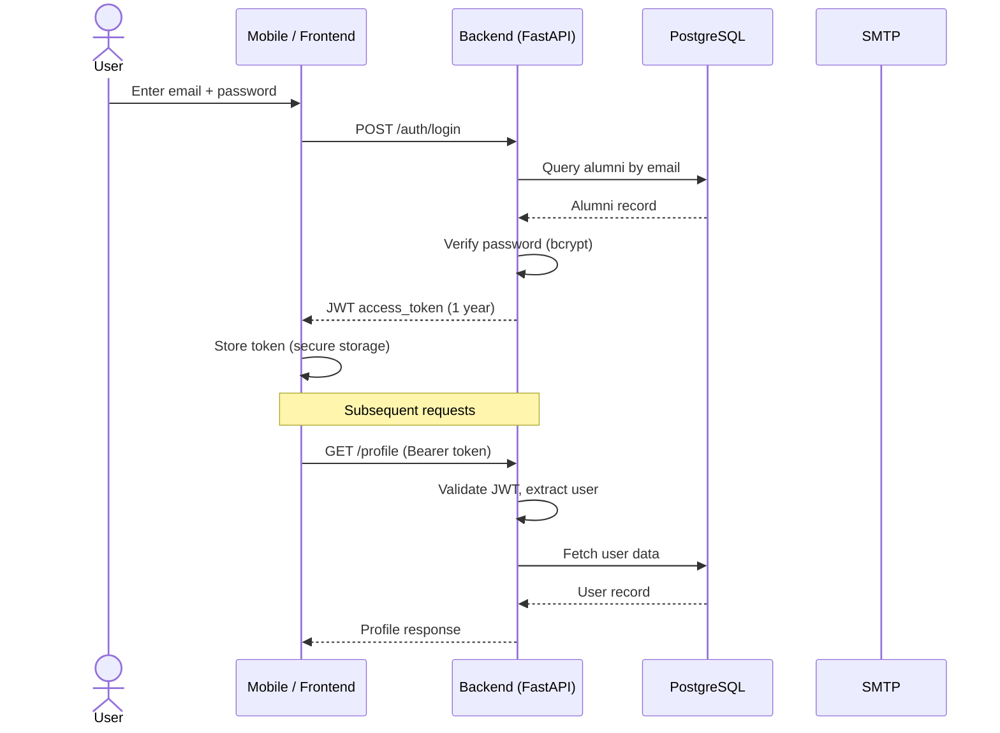
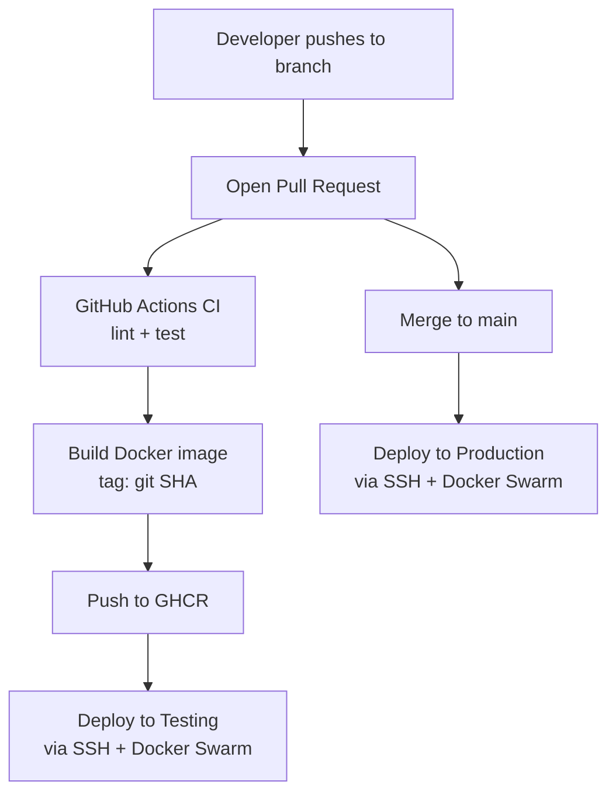

# System Overview

The IU Alumni platform is a multi-component web and mobile system that connects Innopolis University graduates. It consists of four main components: a REST API backend, an admin web portal (frontend), a cross-platform mobile app, and a server infrastructure layer.

## Components

| Component | Technology | Purpose |
|-----------|-----------|---------|
| **Backend** | Python / FastAPI | REST API, business logic, database, integrations |
| **Frontend** | Nuxt 3 / Vue 3 | Admin portal (user & event management) |
| **Mobile** | Flutter / Dart | Alumni-facing mobile app (iOS, Android, Web) |
| **Infrastructure** | Docker Swarm / Ansible / Terraform | Server provisioning, orchestration, CI/CD |

## High-Level Architecture

## Domain Routing

## Data Flow: User Authentication

## CI/CD Flow

## Cross-Cutting Concerns

| Concern | Solution |
|---------|----------|
| **Authentication** | JWT Bearer tokens (HS256, 1-year expiry) |
| **Email Verification** | 6-digit OTP codes via SMTP |
| **Notifications** | Telegram Bot API (event reminders) |
| **Metrics** | Prometheus + Grafana (FastAPI, PostgreSQL, Node) |
| **SSL/TLS** | Let's Encrypt via Certbot (auto-renewed every 12h) |
| **Secrets** | GitHub Actions environment secrets → server `.env` |
| **Container Registry** | GitHub Container Registry (GHCR) |
| **Database Migrations** | Alembic (auto-applied on container start) |
